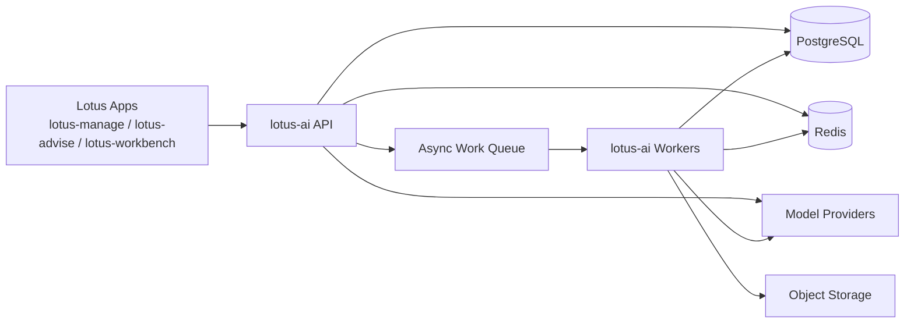
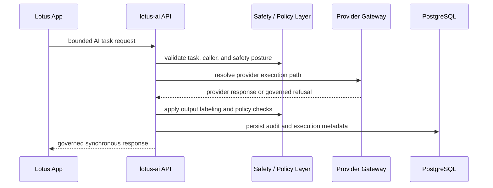
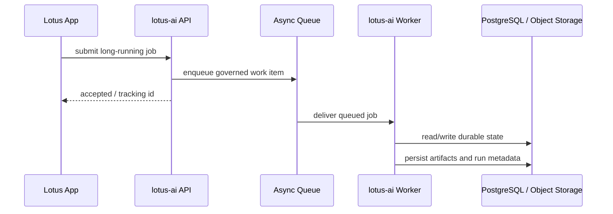
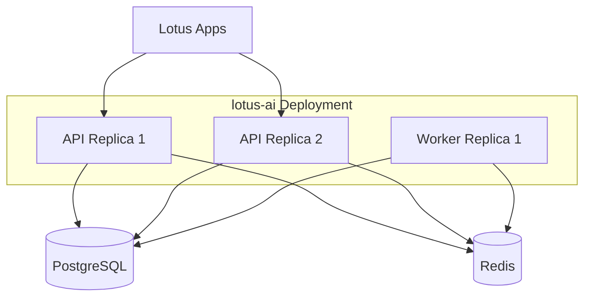
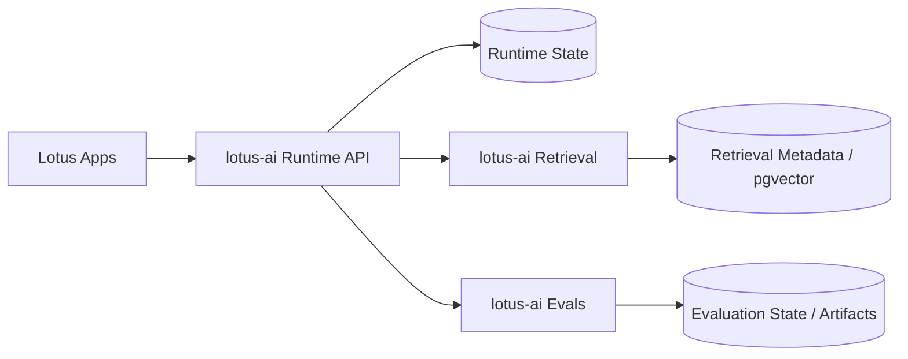

# Scalability And Deployment Model

This document defines the required scalability posture for `lotus-ai`.

It is not optional guidance. It is the architecture we should build toward and protect as the
service grows.

## Scaling Principles

1. `lotus-ai` must remain a platform service, not a domain monolith.
2. API-serving components must stay stateless.
3. Durable state must live in governed stores, never in process memory for production operation.
4. Long-running and high-latency work must be decoupled from synchronous request handling.
5. Internal seams must stay clean enough that high-volume capabilities can split into separate deployables later without changing external contracts.

## Required Runtime Shape

The target operational shape is:

1. API layer
   Handles HTTP contracts, auth, validation, request routing, correlation, and lightweight synchronous orchestration.
2. Worker layer
   Handles retrieval indexing, future evaluation execution, document ingestion, and other long-running tasks.
3. Durable relational store
   PostgreSQL stores prompts, audits, retrieval metadata, evaluation artifacts, and other governed state.
4. Short-lived coordination/cache layer
   Redis handles rate limiting, idempotency helpers, transient coordination, and future queue coordination.
5. Artifact storage
   Object storage is used for larger artifacts when evaluation, retrieval, or trace payloads outgrow relational storage.

### Runtime Diagram

## Stateless API Requirement

The API tier must be horizontally scalable.

That means:

1. no durable workflow state in process memory,
2. no sticky-session assumptions,
3. no single-node execution dependencies for request handling,
4. no runtime behavior that depends on one replica holding private execution history.

Allowed use of in-memory state:

1. local development,
2. deterministic foundation stubs,
3. short-lived caches whose correctness does not depend on cache residency.

## Async Work Requirement

The following classes of work must remain async-capable:

1. retrieval indexing,
2. embedding generation,
3. large document ingestion,
4. future evaluation execution,
5. any multi-step orchestration that could exceed normal request-latency expectations.

This is required so API replicas remain responsive under load and so scaling pressure can be addressed
by worker count instead of only by API count.

### Request Path Diagram

## Scaling Dimensions

`lotus-ai` should scale independently by concern:

1. API replicas for request throughput,
2. worker replicas for background throughput,
3. retrieval/indexing workers for corpus growth,
4. provider-gateway controls for external rate-limit pressure,
5. database and cache tuning for metadata and coordination load.

We should not treat all scaling as "add more app containers."

## Internal Boundaries That Must Stay Clean

The following internal subdomains must remain separable:

1. provider gateway,
2. prompt governance,
3. retrieval,
4. safety and policy,
5. evaluation,
6. audit and supportability.

These may live in one repo and one deployable today, but the code and contracts should assume that
some of them may need independent scaling later.

## Early Deployment Shape

The pragmatic early deployment shape is:

1. one API deployable,
2. one worker deployable,
3. one PostgreSQL instance,
4. one Redis instance,
5. object storage only when artifact size justifies it.

### Early Deployment Diagram

This keeps startup complexity reasonable while preserving the architectural path to later separation.

## Future Split Path

If volume or latency evidence demands it, the likely first split path is:

1. `lotus-ai-runtime`
2. `lotus-ai-retrieval`
3. `lotus-ai-evals`

This should be a deployment split, not an external contract rewrite.

### Future Split Diagram

## Noisy-Neighbor Controls

Because `lotus-ai` is a shared Lotus platform service, it must protect itself from cross-app
interference.

Required controls:

1. per-caller quotas,
2. per-capability rate limits,
3. timeout budgets,
4. idempotent task submission where appropriate,
5. queue isolation for expensive background work,
6. observability broken down by caller app and capability.

## Provider Pressure Is A First-Class Scaling Concern

The most immediate scaling bottleneck will often be external provider latency and rate limits rather
than CPU inside `lotus-ai`.

That means we must design for:

1. explicit provider backpressure,
2. bounded retries,
3. fallback behavior,
4. request shedding when needed,
5. clear caller-visible failure modes.

## Retrieval Pressure Is A First-Class Scaling Concern

Retrieval has its own scaling profile:

1. indexing throughput,
2. chunk volume,
3. embedding generation latency,
4. vector-search performance,
5. source-provenance metadata growth.

That is why retrieval must remain a clean seam and why PostgreSQL plus `pgvector` is the first step,
not the permanent assumption.

## Non-Negotiable Rules

We should follow these strictly:

1. do not couple production correctness to in-memory registries,
2. do not put long-running work on the synchronous request path when a queue-backed path is appropriate,
3. do not let one internal subdomain absorb another's responsibilities just because they share a repo,
4. do not expose external contracts that would make a later deployment split painful,
5. do not bypass audit, correlation, or policy checks for performance shortcuts.

## What Success Looks Like

If we follow this model, `lotus-ai` will scale in a bank-grade way:

1. predictable API behavior under load,
2. isolated background throughput scaling,
3. explicit governance over state and artifacts,
4. clear deployment-split options when usage grows,
5. no accidental dependence on a single replica or hidden in-process state.
