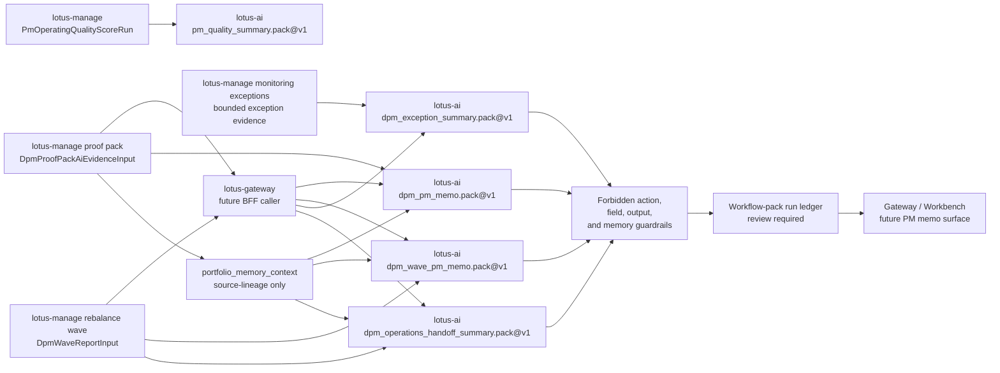
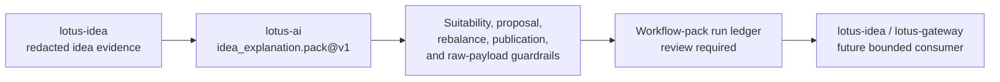

# Integration Guide

## Platform Discovery

Before integrating a Lotus app with `lotus-ai`, upstream teams should inspect:

1. `GET /platform/runtime-status` for the current operating posture,
2. `GET /platform/capabilities` for currently exposed task contracts,
3. `GET /platform/providers` for the current provider execution posture,
4. `GET /platform/providers/policy` for supported provider modes and rejection semantics,
5. `GET /platform/providers/operator-profile` for the active operator profile and switching verification steps,
6. `GET /platform/providers/quota-policy` for configured live-provider quota scopes and typed configuration findings,
7. `GET /platform/providers/budget-policy` for current tracked spend, configured soft and hard budgets, and budget blocking posture,
8. `GET /platform/providers/operations-status` for one combined provider operations view across rollout, quota, budget, and degradation posture,
9. `GET /platform/safety/policy` for task-level output-label and redaction posture,
10. `GET /platform/safety/runtime-status` for current enforced-versus-documented safety controls,
11. `GET /platform/safety/evidence-readiness` for runtime-backed safety approval posture,
12. `GET /platform/safety/runbook-readiness` for operational safety rollout posture,
13. `GET /platform/safety/governance-status` for the combined safety rollout view,
14. `GET /platform/retrieval/runtime-status` for retrieval-specific persistence and corpus posture when retrieval features are relevant,
15. `GET /platform/workflow-packs/registry` for workflow-pack registration truth when onboarding a workflow-bearing integration path.

This keeps downstream integration decisions grounded in actual runtime capability rather than assumptions.

For live-provider integrations, teams should read `/platform/providers/operations-status` as the
operator truth for:

1. `ROLLOUT_BLOCKED`
2. `OPERATIONS_INVALID`
3. `QUOTA_BLOCKED`
4. `BUDGET_SOFT_LIMIT`
5. `BUDGET_BLOCKED`
6. `DEGRADED_UPSTREAM`
7. `CIRCUIT_OPEN`

That surface is more authoritative than inferring provider health from individual task failures.

## Runtime Readiness Semantics

Runtime status endpoints use explicit readiness states for persistence-backed components:

1. `READY`: the configured backend is operational for the current phase.
2. `CONFIGURATION_REQUIRED`: the selected mode requires configuration that is not present.
3. `MIGRATION_REQUIRED`: the backend is reachable but the expected schema is not available yet.
4. `UNAVAILABLE`: the backend could not be reached or the configured mode is unsupported.

Teams should treat `READY` as the only state suitable for relying on durable platform behavior. The other states are informative and should block assumptions about operational persistence.

## Startup Policy

`lotus-ai` supports two startup readiness policies:

1. `warn`
   startup completes and readiness findings are surfaced through runtime-status endpoints
2. `enforce`
   startup is blocked when configured persistence backends are not operational

For shared or enterprise environments, downstream teams should assume `enforce` is the target posture once SQL-backed stores become part of the deployment contract.

## Readiness Probe Policy

`lotus-ai` also separates startup policy from readiness-probe policy:

1. `observe`
   `/health/ready` remains green while runtime-status endpoints expose findings
2. `degrade`
   `/health/ready` reflects startup readiness findings as degraded readiness

This allows teams to adopt stricter operational signaling without forcing an all-or-nothing startup failure policy in every environment.

This guide explains how other Lotus apps should integrate with `lotus-ai`.

## Core Rule

The calling Lotus application owns the business context.

`lotus-ai` should receive structured context that has already been curated by the calling service or by `lotus-gateway`.

For `lotus-workbench` Advisor Brief, the browser should call `lotus-gateway`, and `lotus-gateway`
should assemble the performance fact bundle before invoking `POST /ai/tasks/execute` with
`task_id=explain.v1`. `lotus-ai` should explain only the caller-supplied facts and preserve audit
and evidence metadata; it should not recompute returns, attribution, or benchmark values.

For live LLM-backed Advisor Brief generation in local Docker, `lotus-ai/.env` must enable either
the managed OpenAI text-provider path or the local OpenAI-compatible text-provider path, and the
bounded task allowlist:

1. `LOTUS_AI_PROVIDER_MODE=openai`
2. `LOTUS_AI_PROVIDER_ROLLOUT_STATE=CANARY_ENABLED`
3. `LOTUS_AI_LIVE_TEXT_PROVIDER_ID=text.openai`
4. `LOTUS_AI_LIVE_TEXT_MODEL_ID=<approved model>`
5. `LOTUS_AI_LIVE_TEXT_PROVIDER_API_KEY=<deployment secret>`
6. `LOTUS_AI_LIVE_TEXT_ALLOWED_TASK_IDS=explain.v1`

The `lotus-gateway` caller policy must also allow live-provider execution for `explain.v1`; all
other browser callers should continue to call `lotus-gateway` rather than `lotus-ai` directly.

### Enable a local OpenAI-compatible provider

Use this when `lotus-ai` should execute against a self-hosted or workstation-local model server
that exposes an OpenAI-compatible `/v1/responses` API.

```env
LOTUS_AI_PROVIDER_MODE=local_openai_compatible
LOTUS_AI_PROVIDER_ROLLOUT_STATE=CANARY_ENABLED
LOTUS_AI_LIVE_TEXT_PROVIDER_ID=text.local
LOTUS_AI_LIVE_TEXT_MODEL_ID=<local model id>
LOTUS_AI_LIVE_TEXT_API_BASE=http://<local-provider-host>:<port>/v1
LOTUS_AI_LIVE_TEXT_ALLOWED_TASK_IDS=explain.v1
LOTUS_AI_PROVIDER_TIMEOUT_MS=45000
LOTUS_AI_PROVIDER_MAX_OUTPUT_TOKENS=4096
```

Notes:

1. `LOTUS_AI_LIVE_TEXT_PROVIDER_API_KEY` is optional for `local_openai_compatible` mode and should
   be set only if the local serving layer requires it.
2. `LOTUS_AI_LIVE_TEXT_API_BASE` must not remain the default OpenAI API base when
   `LOTUS_AI_PROVIDER_MODE=local_openai_compatible`.
3. The task contract, audit fields, and gateway integration remain unchanged; only the provider
   runtime mode and backend endpoint switch.

## Local Provider Toggle

Use this when switching between cost-free deterministic mode and live OpenAI-backed generation in
local Docker.

### Disable OpenAI billing

Set this in `lotus-ai/.env`:

```env
LOTUS_AI_PROVIDER_MODE=disabled
```

Then recreate the API and worker containers:

```powershell
cd C:\Users\Sandeep\projects\lotus-ai
docker compose up -d --force-recreate lotus-ai lotus-ai-worker
```

Expected result:

1. `POST /ai/tasks/execute` stays available,
2. responses use the deterministic non-LLM provider path,
3. OpenAI API calls and billing stop,
4. Advisor Brief remains source-grounded but no longer uses live model generation.

### Re-enable OpenAI generation

Set these values in `lotus-ai/.env`:

```env
LOTUS_AI_PROVIDER_MODE=openai
LOTUS_AI_PROVIDER_ROLLOUT_STATE=CANARY_ENABLED
LOTUS_AI_LIVE_TEXT_PROVIDER_ID=text.openai
LOTUS_AI_LIVE_TEXT_MODEL_ID=<approved model>
LOTUS_AI_LIVE_TEXT_PROVIDER_API_KEY=<deployment secret>
LOTUS_AI_LIVE_TEXT_ALLOWED_TASK_IDS=explain.v1
LOTUS_AI_PROVIDER_TIMEOUT_MS=45000
LOTUS_AI_PROVIDER_MAX_OUTPUT_TOKENS=4096
```

Then recreate the same containers with `docker compose up -d --force-recreate lotus-ai lotus-ai-worker`.

Verification:

1. `GET /health/ready` should return `200`,
2. `POST /ai/tasks/execute` should return `audit.provider_mode = "openai"`, `audit.provider_id = "text.openai"`, and `audit.stubbed = false`
   when the live provider key has quota,
3. if billing must remain off, verify `audit.provider_mode` is not `openai` before using Advisor Brief.

### Switch to a local live model

Set these values in `lotus-ai/.env`:

```env
LOTUS_AI_PROVIDER_MODE=local_openai_compatible
LOTUS_AI_PROVIDER_ROLLOUT_STATE=CANARY_ENABLED
LOTUS_AI_LIVE_TEXT_PROVIDER_ID=text.local
LOTUS_AI_LIVE_TEXT_MODEL_ID=<local model id>
LOTUS_AI_LIVE_TEXT_API_BASE=http://<local-provider-host>:<port>/v1
LOTUS_AI_LIVE_TEXT_ALLOWED_TASK_IDS=explain.v1
LOTUS_AI_PROVIDER_TIMEOUT_MS=45000
LOTUS_AI_PROVIDER_MAX_OUTPUT_TOKENS=4096
```

Then recreate the same containers with `docker compose up -d --force-recreate lotus-ai lotus-ai-worker`.

Verification:

1. `GET /health/ready` should return `200`,
2. `POST /ai/tasks/execute` should return `audit.provider_mode = "local_openai_compatible"`,
   `audit.provider_id = "text.local"`, and `audit.stubbed = false`,
3. `/platform/providers/policy` should list `local_openai_compatible` in the allowed text modes,
4. `/platform/providers` should show `text.local` in the registered provider catalog,
5. `/platform/providers/operator-profile` should identify either `local_ollama` or `local_vllm`,
6. the provider-resolution evidence descriptor should show `adapter_kind = OPENAI_COMPATIBLE_LOCAL`
   and the configured local `model_id`.
7. for advisor-brief tasks, low-quality local generations that echo prompt or contract language
   should now be replaced by a deterministic source-grounded fallback rather than being returned
   directly to downstream callers.
8. a small local model may still be operationally slower than the managed-provider path for a
   full advisor-brief fact bundle. Treat local-mode model choice and serving capacity as an
   explicit operator decision, not an assumed production-quality default.

Current local default:

```env
LOTUS_AI_PROVIDER_MODE=local_openai_compatible
LOTUS_AI_LIVE_TEXT_PROVIDER_ID=text.local
LOTUS_AI_LIVE_TEXT_MODEL_ID=qwen2.5:1.5b
LOTUS_AI_LIVE_TEXT_API_BASE=http://ollama:11434/v1
```

That profile is cost-free and platform-valid, but it should be qualified against actual latency and
output-quality expectations before being treated as a private-bank-grade default for all users.

## Recommended Integration Pattern

1. Build a domain-owned context payload.
2. Select a bounded AI task id.
3. Call `lotus-ai` with correlation id and caller metadata.
4. Receive structured AI output and audit metadata.
5. Apply that output only within the calling service's own business rules.

For new downstream onboarding, start with the capability-pack layer first:

1. `GET /platform/capability-packs`
2. `GET /platform/capability-packs/{pack_id}`
3. `GET /platform/capability-packs/{pack_id}/adoption-template`
4. `GET /platform/capability-packs/{pack_id}/governance-status`

If the selected path is evolving into a workflow-bearing pack rather than a bounded task wrapper, inspect the workflow-pack registry next:

1. `GET /platform/workflow-packs/registry`
2. `GET /platform/workflow-packs/registry/{pack_id}/default`
3. `GET /platform/workflow-packs/registry/{pack_id}/{version}`
4. `POST /platform/workflow-packs/eligibility/evaluate`

When reading workflow-pack registry detail, treat ownership fields as governed onboarding evidence:

1. `owner_repository` identifies the repo that still owns the workflow-bearing implementation,
2. `definition_ref` is the primary owner artifact that anchors the registration,
3. `definition_refs` list the supporting contract, service, router, test, and optional product RFC or UI validation artifacts that justify the registration,
4. a workflow-pack should not be considered properly onboarded if those references are vague, stale, or point only to `lotus-ai` placeholder docs.

Default-version resolution is deliberately conservative. The default route returns the current
registered, activation-eligible, non-superseded version for a pack family so callers and operators
can discover the governed default without assuming that a discovered or dark successor version is
ready to run.

For a future-pack-owner checklist and the Phase-1 `advisor_brief.pack` reference pattern, use:

- `docs/guides/workflow-pack-owner-onboarding.md`

For operator review or emergency posture changes, use the workflow-pack control surfaces:

1. `GET /platform/workflow-packs/control-history`
2. `POST /platform/workflow-packs/control-actions`

Then use the first-use-case surfaces as the concrete reference path when the selected pack already has one:

1. `GET /platform/use-cases/onboarding-template`
2. `GET /platform/use-cases/first-production-use-case`
3. `GET /platform/use-cases/first-production-use-case/governance-status`

That sequence keeps downstream adoption pack-oriented first, while still preserving the currently implemented reference use case and its bounded rollout truth.

## Good Use Cases

### Preferred first integration: lotus-performance

1. Explain already computed performance deltas.
2. Summarize material attribution or period-over-period changes.
3. Keep outputs commentary-oriented and grounded in structured analytics owned by `lotus-performance`.
4. Review `GET /platform/use-cases/first-production-use-case/readiness` before treating the integration as ready for limited governed onboarding.
5. Review `GET /platform/use-cases/first-production-use-case/governance-status` before treating the integration as ready for limited governed rollout.

### lotus-manage

1. Explain rebalance outcome.
2. Summarize blocking diagnostics.
3. Draft reviewer notes for support or operations.
4. Use `dpm_pm_memo.pack@v1` only with manage-owned `DpmProofPackAiEvidenceInput`, a bounded
   `memo_request`, supportability posture, and optional manage-owned `portfolio_memory_context`.
   Requests for trade recommendations, order instructions, rebalance approval, client messages, PM
   scoring, control override, or invented missing evidence are guardrail-blocked before execution
   and should be corrected in the calling workflow rather than retried with prompt wording.
5. Use `outcome_review_narrative.pack@v1` only with manage-owned `DpmOutcomeAiEvidenceInput`,
   a bounded `narrative_request`, supportability posture, and optional manage-owned
   `portfolio_memory_context`. Requests for PM scoring, client messages, trade approval, control
   override, or invented missing evidence are guardrail-blocked before execution and should be
   fixed in the calling workflow rather than retried with different prompt wording.
6. Use `dpm_wave_pm_memo.pack@v1` only with manage-owned `DpmWaveReportInput`, a bounded
   `memo_request`, supportability posture, and optional manage-owned `portfolio_memory_context`.
   Requests for rebalance approval, trade recommendations, order tickets, client messages,
   external execution claims, control override, or invented missing wave or proof-pack evidence
   are guardrail-blocked before execution and should be corrected in the caller contract rather
   than retried with prompt wording.
7. Use `dpm_exception_summary.pack@v1` only with bounded manage-owned monitoring exception
   evidence, a bounded `exception_summary_request`, supportability posture, source refs,
   `NO_RAW_PAYLOADS`, and requested outputs such as `exception_summary`, `severity_summary`,
   `recommended_triage`, `support_references`, or `evidence_gaps`. Requests for rebalance
   approval, order instructions, client messages, PM scoring, control override, or invented
   exception evidence are guardrail-blocked before execution and should be corrected at the source
   evidence boundary.
8. Use `dpm_operations_handoff_summary.pack@v1` only with manage-owned `DpmWaveReportInput`,
   non-empty bounded `handoff_refs`, a bounded `handoff_summary_request`, supportability posture,
   and optional manage-owned `portfolio_memory_context`. Requests for order tickets, routing
   instructions, execution instructions, trade recommendations, client messages, external execution
   claims, control override, or invented missing handoff evidence are guardrail-blocked before
   execution and should be corrected at the source evidence boundary.
9. Use `pm_quality_summary.pack@v1` only with Manage-owned `PmOperatingQualityScoreRun` evidence,
   a bounded `summary_request`, supportability posture, source refs, and optional manage-owned
   `portfolio_memory_context`. Requests for PM ranking, HR ratings, compensation recommendations,
   conduct actions, client messages, trade approvals, execution instructions, or invented missing
   score-run evidence are guardrail-blocked before execution and should be corrected at the source
   evidence boundary.

When supplied, `portfolio_memory_context` is lineage context, not a source-fact replacement. It must
match the AI-evidence portfolio id, carry source-owned governance including `NO_RAW_PAYLOADS` and a
no-reconstruction source-authority policy, and remain within the bounded event-ref limit. `lotus-ai`
returns compact portfolio-memory summary fields so downstream demo and review surfaces can show
timeline provenance without raw payloads or inferred business facts.



### lotus-idea

Use `idea_explanation.pack@v1` only when the caller supplies:

1. a `redacted_evidence_packet` owned by `lotus-idea`,
2. a bounded `explanation_request` that asks for advisor-support explanation, evidence gaps,
   support references, or review-ready rationale,
3. `supportability` posture that states source readiness, human-review need, and unsupported
   claims.

The pack is review-gated and support-only. It blocks suitability approval, proposal authority,
rebalance authority, client-ready publication, supported-feature promotion, raw source payload
exposure, raw prompt or generated-output exposure, and invented missing evidence. `lotus-idea`
remains the opportunity-intelligence, idea lifecycle, and idea-evidence authority; `lotus-ai`
provides the governed workflow-pack runtime, review posture, queue policy, and safety guardrails.
The `lotus-idea` caller policy is restricted to `explain.v1` for the governed tenant scope and does
not grant live-provider or control-plane privilege.



The memo flows are support-only. `lotus-ai` may draft review-gated memo posture from bounded
proof-pack or wave evidence, but `lotus-manage` keeps proof-pack truth, wave truth, and any
downstream PM/CIO/operations workflow authority.

### lotus-advise

1. Summarize proposal workflow status.
2. Draft approval-pack commentary.
3. Explain suitability or gate recommendations.

### lotus-risk and lotus-performance

1. Turn structured analytics into narrative explanations.
2. Summarize material changes between periods or scenarios.

### lotus-core

1. Summarize ingestion or support anomalies.
2. Explain likely causes from structured lineage/support data.

## Bad Use Cases

1. Replacing domain calculations with LLM guesses.
2. Letting `lotus-ai` invent missing core business data.
3. Asking `lotus-ai` to authoritatively decide approvals or trade execution.
4. Sending uncurated, overly broad data just because it might help.

## Request Design Guidance

Every request should include:

1. `task_id`
2. `caller_app`
3. `correlation_id`
4. `input_mode`
5. structured context object
6. expected output mode

Prefer smaller, explicit context bundles over large raw payload dumps.

## Retrieval Guidance

If retrieval is used:

1. retrieval sources should be explicit,
2. cited output should keep source references,
3. platform docs and approved standards should be favored over ad hoc notes.
## Provider Switching Runbook

Use [provider-mode-switching.md](C:/Users/Sandeep/projects/lotus-ai/docs/runbooks/provider-mode-switching.md) as the authoritative operator procedure for:

1. switching between `disabled`, `openai`, and `local_openai_compatible`,
2. bringing up developer-local Ollama,
3. validating stronger-host vLLM deployment,
4. verifying the active provider path through runtime and task evidence.
