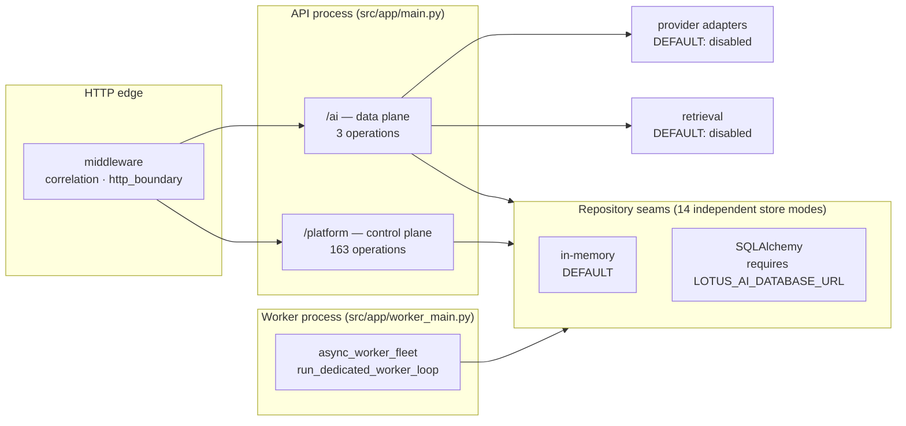

# Architecture

Implementation-backed description of `lotus-ai` as it exists on `main`. Every measurement below was
taken from the running application or the source tree; where something is planned rather than built,
it says so. Counts were measured on 2026-08-27.

## What this service is

`lotus-ai` is a **governed AI execution service**, and in surface area it is overwhelmingly a
control plane. Measured from the published OpenAPI document:

| segment | operations |
|---|---|
| `/platform/**` — governance, rollout, evidence | **163** |
| `/ai/**` — the AI data plane | **3** |
| operational and discovery (`/`, `/health`, `/health/live`, `/health/ready`, `/metadata`, `/metrics`, `/.well-known/lotus-ai-workflow-attestation-keys`) | 7 |
| **total published operations** | **173** |

The entire AI data plane is three endpoints:

```
POST /ai/tasks/execute      execute a governed task
GET  /ai/audit              list audit records, tenant-scoped
GET  /ai/audit/{request_id} read one audit record, tenant-scoped
```

Everything else exists to decide whether that execution is allowed, with what prompt, against which
provider, under which policy — and to prove afterwards what happened. A new engineer who expects an
"AI service" will find a governance service with an AI seam, and reading it the other way round is
the fastest way to get lost.

The largest `/platform` groups, by operation count: `workflow-packs` (29), `retrieval` (21),
`observability` (12), `providers` (12), `async` (11), `prompts` (10), `app-capability-rollouts` (8),
`capability-packs` (8).

## Runtime shape



Two deployable processes share one codebase and one configuration surface: the FastAPI application,
and a dedicated worker (`src/app/worker_main.py` → `run_dedicated_worker_loop`) driven by
`LOTUS_AI_ASYNC_WORKER_ID` and `LOTUS_AI_ASYNC_WORKER_QUEUE_POLL_SECONDS`.

## The default posture is non-durable and non-live

This is the single most operationally important fact about the service, and it is easy to miss
because it is spread across fourteen independent settings.

**Every durable store defaults to `memory`.** A restart loses all of it.

```
audit_store_mode                          prompt_store_mode
retrieval_store_mode                      access_control_store_mode
workflow_pack_registry_store_mode         provider_operations_store_mode
provider_retention_confirmation_store_mode  async_runtime_store_mode
workflow_pack_run_store_mode              workflow_pack_task_flow_store_mode
workflow_pack_queue_event_store_mode      evaluation_runtime_store_mode
artifact_store_mode                       artifact_object_store_mode
```

**Every outbound capability defaults to off:**

| setting | default | meaning at default |
|---|---|---|
| `provider_mode` | `disabled` | no live model calls |
| `retrieval_mode` | `disabled` | no retrieval execution |
| `embedding_provider_mode` | `disabled` | no embedding calls |
| `safety_mode` | `documented_only` | safety posture is declared, not enforced at runtime |
| `async_queue_backend_mode` | `none` | no managed queue |
| `local_header_caller_identity_enabled` | `false` | header-asserted identity is not accepted as privileged |

All settings take the `LOTUS_AI_` environment prefix (`src/app/config.py:93`,
`env_prefix="LOTUS_AI_"`). Store modes accept exactly `memory` or `sqlalchemy`.

### How the switches behave

Selection is fail-closed, which is worth relying on (`src/app/services/audit_store.py:12-24` is the
pattern the other stores follow):

- `sqlalchemy` **without** `LOTUS_AI_DATABASE_URL` → `RuntimeError`, naming the missing variable.
- any value that is neither `memory` nor `sqlalchemy` → `RuntimeError: Unsupported ..._STORE_MODE.`

The settings are plain `str` fields with no `Literal` constraint, so a typo is caught at first use
rather than at startup validation. Treat a store-mode change as needing a smoke request against a
route that touches that store.

## Request lifecycle

For `POST /ai/tasks/execute`, the runtime is deliberately staged rather than one orchestration block:

1. validate the task and request shape against the contracts in `src/app/contracts/`
2. build one shared runtime context
3. resolve prompt selection and safety posture
4. execute through the provider or retrieval seam
5. assemble evidence and operator-facing metadata
6. persist the audit record

Stages 3–6 are where the governance surfaces attach; the split exists so a rollout or policy change
does not require editing the execution path.

## Caller identity and tenant scope

Protected routes require a trusted upstream caller identity in `X-Caller-App`. Measured on `main`:
of 173 published operations, the **167** not on the public allowlist all refuse a caller with no
identity; the six allowlisted paths (`/`, `/health`, `/health/live`, `/health/ready`, `/metadata`,
`/metrics`) still answer. This is enforced by a test derived from the published OpenAPI surface
rather than a hand-maintained list, so a new route is covered the moment it is published.

Audit reads are additionally **tenant-scoped from server-side policy**
(`src/app/services/audit_read_authorization.py:26-38`):

- the caller's `CallerPolicyDescriptor` is looked up by authenticated `caller_app`
- a missing or non-`ACTIVE` policy → `403`
- `allow_audit_read_all_tenants` grants all-tenant reads **only** for a privileged identity
  (`is_privileged_caller_identity_accepted`), and only when no restricted tenant list is also set
- otherwise the scope is restricted to the policy's tenant list; an empty list → `403`

The tenant is never taken from the request: `/ai/audit` rejects a client-supplied `tenant_id` query
parameter with `422`. `RESTRICTED_TENANTS` is applied as a SQL predicate, not an application-layer
filter after fetching.

### Attestation keys are not publicly discoverable

`GET /.well-known/lotus-ai-workflow-attestation-keys` is **not** in `PUBLIC_UNAUTHENTICATED_PATHS`
and returns **`403`** to a caller without identity — verified against the running application.

This is worth stating explicitly because it cuts against the convention of the `.well-known`
namespace, which exists so that a party who does *not* yet hold credentials can discover a service's
public material. As implemented, only an already-trusted caller can fetch the public keys needed to
verify a workflow-run attestation.

If the intended verifiers are all internal trusted callers, this is correct and simply
non-obvious — integrators should not plan on anonymous key fetch. If an external or offline verifier
is ever in scope, the endpoint's placement in the protected set needs revisiting. Recorded here as
observed behaviour, not as a defect judgement.

## Known gaps

Recorded so they are not mistaken for behaviour that works. Each is a tracked issue.

| gap | effect | issue |
|---|---|---|
| `GET /platform/observability/breakdowns` performs an all-tenant audit read with no per-caller scope check | any authenticated caller can enumerate every tenant id and per-tenant execution volume; not recorded in the audit access trail | [#168](https://github.com/sgajbi/lotus-ai/issues/168) |
| `monetary-float-guard` is declared in the `Makefile` and invoked by nothing | run by hand it exits 1 with five findings, two genuinely monetary | [#165](https://github.com/sgajbi/lotus-ai/issues/165) |
| `safety_mode` defaults to `documented_only` | redaction posture is declared per task, not enforced at runtime | — |
| callers remain responsible for context minimisation | the service does not trim caller-supplied context | — |

The `#168` gap matters for how you read the tenant-scope section above: that model is real and
enforced on `/ai/audit`, and one observability route currently sits outside it.

## Architectural boundaries

The service deliberately does not own:

1. business-domain state — it holds no portfolio, position or client record
2. uncontrolled autonomous tool use on production-facing paths
3. orchestration frameworks as public architecture — libraries may reduce plumbing, but task
   contracts, audit boundaries and policy gates stay explicit
4. context minimisation on the caller's behalf

## Source map

| area | path | notes |
|---|---|---|
| API composition, allowlist | `src/app/main.py` | single `include_router` loop over `PROTECTED_ROUTER_BINDINGS` |
| public contracts | `src/app/contracts/` | 32 modules |
| routers | `src/app/routers/` | 20 modules, one per surface group |
| orchestration and runtime | `src/app/services/` | 229 modules — the bulk of the service |
| repository seams | `src/app/repositories/` | 38 modules; memory and SQLAlchemy pairs |
| provider adapters | `src/app/providers/` | rollout, quota, budget, degradation |
| retrieval | `src/app/retrieval/` | source and document governance, search posture |
| safety | `src/app/safety/` | output-label-aware policy |
| evaluations | `src/app/evals/` | fixtures, runtime, approval gates |
| middleware | `src/app/middleware/` | `correlation`, `http_boundary` |
| worker entrypoint | `src/app/worker_main.py` | dedicated fleet loop |
| settings | `src/app/config.py` | 96 lines; every posture switch |

Deeper rationale lives in `docs/architecture/system-overview.md`,
`docs/architecture/scalability-and-deployment-model.md`,
`docs/architecture/startup-readiness-deployment-policy.md` and
`docs/architecture/decision-log.md`.

## Read next

1. [Platform Surfaces](./Platform-Surfaces.md) — the grouped route map
2. [Security and Governance](./Security-and-Governance.md) — caller identity, output labelling, evidence
3. [Getting Started](./Getting-Started.md) — local runtime choices
4. [Operations Runbook](./Operations-Runbook.md) — running and supporting the service
