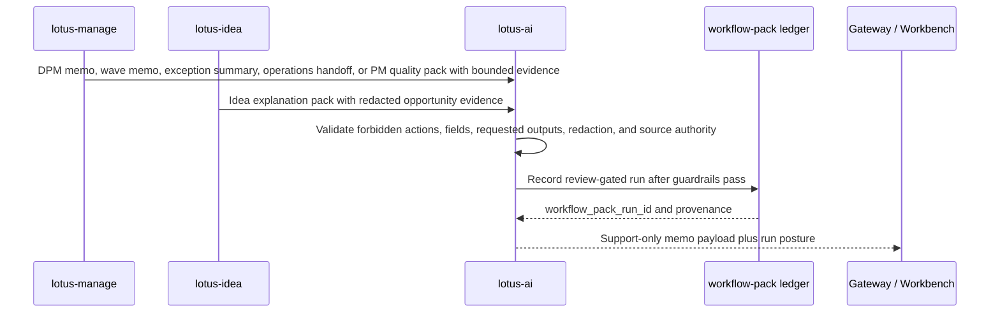
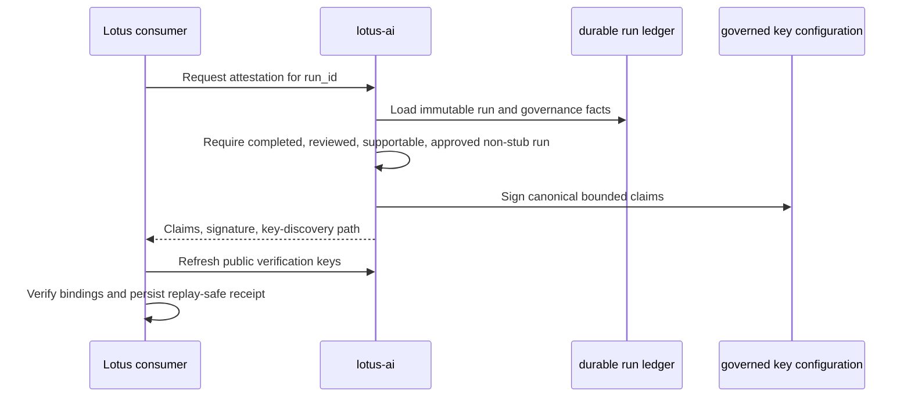

# Integrations

## Current Scope

This page documents implemented `lotus-ai` integration contracts and ownership boundaries. It
separates direct task execution, workflow-pack execution, source-safe provenance, and operational
inspection so consumers do not mistake an available route for transferred business authority.

| Reader need | Start here | Evidence or decision |
|---|---|---|
| Execute a bounded AI task | [Primary Executable Contracts](#primary-executable-contracts) | Request, response, audit, and evidence contract |
| Integrate a workflow pack | [Workflow-Pack Integration](#workflow-pack-integration) | Registration, eligibility, review, and authority boundary |
| Verify portable provenance | [Signed Workflow-Run Provenance](#signed-workflow-run-provenance) | Signed claims and public-key discovery |
| Diagnose provider or safety posture | [Provider and Safety Expectations](#provider-and-safety-expectations) | Runtime operator surfaces and fail-closed controls |

## Integration Model

`lotus-ai` is consumed through governed task and platform contracts.

The rule that matters most is:

1. the calling application owns the business context,
2. `lotus-ai` executes bounded AI behavior against that context,
3. the calling system remains accountable for business meaning and user-facing consequences.

## Primary Executable Contracts

The main executable contracts are:

1. `POST /ai/tasks/execute`
2. `GET /ai/audit`
3. `GET /ai/audit/{request_id}`

These three routes cover the real minimum integration loop:

1. submit one bounded task request,
2. receive a structured result plus audit and evidence metadata,
3. inspect the persisted audit trail when support or governance review is required.

Audit inspection is caller-policy scoped. Both `GET /ai/audit` and
`GET /ai/audit/{request_id}` require trusted `X-Caller-App`; consumers cannot select tenant scope
through a query parameter. Restricted services see only their configured tenants, cross-scope
detail is returned as the same safe `404` as a missing record, and only the explicit
`lotus-platform` capability can inspect all tenants and legacy unattributed records. Every
legacy row is explicitly labeled `tenant_state=LEGACY_UNATTRIBUTED`, and every all-tenant read must
persist a separate identifier-minimized access event before a response is returned. Verified
service JWT or mTLS identity remains separate follow-up work under issue #149.

The task execution contract itself requires:

1. `task_id`
2. `input_mode`
3. `caller`
4. `context`

The response returns:

1. execution status,
2. task category and output label,
3. result payload,
4. audit metadata,
5. structured execution evidence.

That audit and evidence shape is part of the real integration contract and should be preserved by
downstream systems.

## Direct Task API Versus Task-Runtime Inspection

Do not confuse the direct execution route with the task-runtime inspection surface.

These are different:

1. direct execution
   - `POST /ai/tasks/execute`
2. task-runtime inspection
   - `/platform/tasks/runtime-status`
   - `/platform/tasks/execution-summary`
   - `/platform/tasks/evidence-summary`
   - `/platform/tasks/retrieval-summary`
3. capability discovery
   - `/platform/capabilities`

Downstream systems should call the direct execution route for work, and use the task-runtime and
capability surfaces for onboarding, support review, and rollout decisions.

## Platform Discovery Contracts

Before integrating deeply, downstream teams should inspect the platform surfaces rather than infer
capability from one successful task response.

The most important discovery endpoints are:

1. `/platform/runtime-status`
2. `/platform/capabilities`
3. `/platform/providers`
4. `/platform/providers/policy`
5. `/platform/providers/operator-profile`
6. `/platform/providers/operations-status`
7. `/platform/prompts/runtime-status`
8. `/platform/safety/policy`
9. `/platform/retrieval/runtime-status`
10. `/platform/evals/runtime-status`

For more rollout-sensitive integrations, also inspect:

1. `/platform/tasks/runtime-status`
2. `/platform/access-control/caller-policies`
3. `/platform/capability-packs`
4. `/platform/workflow-packs/registry`
5. `/platform/use-cases/first-production-use-case`
6. `/platform/app-capability-rollouts`

## Gateway-First Rule

For product flows, the browser should normally call `lotus-gateway`, not `lotus-ai` directly.

The intended pattern is:

1. the browser calls `lotus-gateway`,
2. `lotus-gateway` assembles the governed fact bundle,
3. `lotus-gateway` invokes `lotus-ai`,
4. downstream UI preserves audit and evidence metadata from the result.

This keeps business context assembly and product ownership in the correct Lotus layer.

Direct service-to-service callers can integrate with `lotus-ai` directly, but they should still
follow the same ownership boundary:

1. the caller owns the business fact bundle,
2. `lotus-ai` owns bounded AI execution and evidence assembly,
3. the caller owns the business decision made from the result.

## Retrieval-Backed Integrations

Retrieval-backed tasks are special because they expose more than a plain text response.

`knowledge_search.v1` and `knowledge_answer.v1` can carry:

1. bounded retrieval hits,
2. citations,
3. support or refusal posture,
4. retrieval execution details such as catalog fallback versus live indexed retrieval.

Downstream systems should preserve those distinctions instead of flattening them into one generic
answer string.

They should also inspect retrieval posture directly when retrieval-backed behavior matters:

1. `/platform/retrieval/runtime-status`
2. `/platform/retrieval/execution-status`
3. `/platform/retrieval/source-governance`
4. `/platform/retrieval/document-governance`
5. `/platform/retrieval/search`

## Downstream Adoption Surfaces

`lotus-ai` also exposes higher-level adoption surfaces:

1. `/platform/capability-packs`
2. `/platform/workflow-packs/registry`
3. `/platform/use-cases/first-production-use-case`
4. `/platform/use-cases/onboarding-template`
5. `/platform/app-capability-rollouts`

These are useful when the integration work is about productized downstream rollout rather than only
calling one task endpoint.

The practical sequence for a new downstream adoption is:

1. inspect `/platform/capability-packs`
2. inspect the selected pack detail and adoption template
3. inspect `/platform/workflow-packs/registry` when the pack is intended to become a workflow-bearing runtime family
4. evaluate `/platform/workflow-packs/eligibility/evaluate` with the caller and surface posture that will actually invoke the pack
5. inspect `/platform/workflow-packs/control-history` when operator pause, resume, deprecate, or retire posture matters
6. inspect `/platform/use-cases/onboarding-template`
7. inspect `/platform/use-cases/first-production-use-case`
8. inspect `/platform/app-capability-rollouts`

That sequence keeps app-facing productization separate from low-level task execution.

For workflow-pack onboarding specifically, use `docs/guides/workflow-pack-owner-onboarding.md` as
the owner-facing procedure and do one more truth check before treating a registration as real:

1. `owner_repository` should match the repo that owns the workflow-bearing code path,
2. `definition_ref` should point at a real owner artifact, not a placeholder design note,
3. `definition_refs` should include enough owner-repo evidence to cover contract, service or router, and regression tests,
4. optional cross-repo RFC or UI references are supporting evidence, not a substitute for owner-repo truth.

## DPM PM Memo Integration

`dpm_pm_memo.pack@v1`, `dpm_wave_pm_memo.pack@v1`, `dpm_exception_summary.pack@v1`,
`dpm_operations_handoff_summary.pack@v1`, `pm_quality_summary.pack@v1`, and
`idea_explanation.pack@v1` are the current
`lotus-ai` owner-side execution contracts
for governed DPM and idea-support drafting from source-owned evidence. The proof-pack pack is for single
proof-pack evidence, the wave pack is for rebalance-wave PM memo evidence, the exception pack is
for bounded monitoring exception evidence, and the operations pack is for bounded internal handoff
evidence that may summarize staged wave items and handoff refs. The PM quality pack is for
support-only summaries over Manage-owned `PmOperatingQualityScoreRun` evidence. The idea
explanation pack is for bounded support explanation over `lotus-idea` redacted opportunity
evidence packets.

Use it only when the caller supplies:

1. `ai_evidence_input` shaped as `lotus-manage` `DpmProofPackAiEvidenceInput`,
2. `memo_request` with allowed requested outputs such as `pm_memo`, `rationale_summary`,
   `approval_checklist`, `risk_caveats`, `operations_handoff`, or `evidence_gaps`,
3. `supportability` posture that states source readiness, human-review need, and unsupported claims,
4. optional `portfolio_memory_context` only when `lotus-manage` supplies the bounded report-input
   handoff context for the same portfolio.

The pack blocks requests for trade recommendations, order tickets, rebalance approval, client
messages, PM scoring, control overrides, hidden source inference, or forbidden sensitive fields.
When portfolio memory is supplied, it is validated as source-lineage-only context: matching
portfolio id, capped event refs, `NO_RAW_PAYLOADS`, source content hash, and a source-authority
policy that forbids reconstructing missing risk, performance, execution, report, or AI truth.
Downstream Gateway and Workbench product surfaces should preserve `workflow_pack_run_id`, proof-pack
hashes, AI-evidence hash, portfolio-memory content hash, review posture, and unsupported-claim
posture rather than flattening the memo into plain text.

When portfolio-memory consumers need AI-owned source events, use
`GET /platform/workflow-packs/source-events` for a filtered catalog or
`GET /platform/workflow-packs/runs/{run_id}/source-events` for one run. These routes project source
events from workflow-pack run-ledger truth and return stable AI event identity, pack/run identity,
workflow-authority owner, review/supportability posture, governed artifact refs, bounded source
refs, and portfolio-memory status/count/hash when supplied. They are deliberately not raw-output or
raw-source replay APIs: raw prompts, raw generated output, raw source payloads, and raw
portfolio-memory event payloads stay out of the response.

Use `dpm_wave_pm_memo.pack@v1` only when the caller supplies:

1. `wave_report_input` shaped as `lotus-manage` `DpmWaveReportInput`,
2. `memo_request` with allowed requested outputs such as `wave_pm_memo`,
   `wave_rationale_summary`, `approval_checklist`, `risk_caveats`, `operations_handoff`, or
   `evidence_gaps`,
3. `supportability` posture with required forbidden actions and unsupported claims,
4. optional `portfolio_memory_context` only when `lotus-manage` supplies bounded source-lineage
   context for the same portfolio.

The wave pack additionally blocks external-execution claims and requires non-empty source refs,
bounded wave items, proof-pack posture, and `NO_RAW_PAYLOADS` redaction before run, audit, or
task-flow records are written.

Use `dpm_exception_summary.pack@v1` only when the caller supplies:

1. `exception_summary_input` from manage-owned monitoring exception evidence,
2. bounded source refs with source system, content hash, and no raw payloads,
3. `exception_summary_request` with allowed requested outputs such as `exception_summary`,
   `severity_summary`, `recommended_triage`, `support_references`, or `evidence_gaps`,
4. `supportability` posture with required forbidden actions and unsupported claims.

The exception pack blocks rebalance approval, order instructions, client messages, PM scoring,
control overrides, and invented missing exception evidence before run, audit, or task-flow records
are written.

Use `dpm_operations_handoff_summary.pack@v1` only when the caller supplies:

1. `wave_report_input` shaped as `lotus-manage` `DpmWaveReportInput`,
2. non-empty bounded `handoff_refs` with ref type, ref id, source system, and content hash,
3. `handoff_summary_request` with allowed requested outputs such as `operations_summary`,
   `execution_prerequisites`, `blocking_conditions`, `support_references`, or `evidence_gaps`,
4. `supportability` posture with required forbidden actions and unsupported claims,
5. optional `portfolio_memory_context` only when `lotus-manage` supplies bounded source-lineage
   context for the same portfolio.

The operations handoff pack blocks order tickets, routing instructions, external-execution claims,
trade recommendations, client messages, and inferred missing handoff evidence before run, audit, or
task-flow records are written.

Use `pm_quality_summary.pack@v1` only when the caller supplies:

1. `score_run` shaped as Manage-owned `PmOperatingQualityScoreRun`,
2. `summary_request` with allowed requested outputs such as `score_run_summary`,
   `governance_summary`, `fairness_review_posture`, `support_references`, or `evidence_gaps`,
3. `supportability` posture with required forbidden actions and unsupported claims,
4. optional `portfolio_memory_context` only when `lotus-manage` supplies bounded source-lineage
   context for the same portfolio.

The PM quality pack blocks PM ranking, HR ratings, compensation recommendations, conduct actions,
client messages, trade approvals, execution instructions, and inferred missing score-run evidence
before run, audit, or task-flow records are written. It does not calculate PM scores or own
fairness analysis.

Use `idea_explanation.pack@v1` only when the caller supplies:

1. a `redacted_evidence_packet` owned by `lotus-idea`,
2. a bounded `explanation_request` for advisor-support explanation, evidence gaps, support
   references, or review-ready rationale,
3. `supportability` posture with human-review requirement and unsupported claims.

The idea explanation pack blocks suitability approval, proposal authority, rebalance authority,
client-ready publication, supported-feature promotion, raw source payload exposure, raw prompt or
generated-output exposure, and invented missing evidence before run, audit, or task-flow records are
written. It does not own idea lifecycle truth; that authority stays in `lotus-idea`. The
`lotus-idea` caller policy is restricted to `explain.v1` for the governed tenant scope and does not
grant live-provider or control-plane privilege.



`outcome_review_narrative.pack@v1` follows the same boundary for
`DpmOutcomeAiEvidenceInput`: `lotus-ai` can draft PM, CIO, control, operations, and evidence-gap
support commentary, but cannot score portfolio managers, contact clients, approve trades, override
controls, or infer timeline facts absent from source-owned Manage evidence.

Use the RFC-0027 advisory copilot packs only when `lotus-advise` supplies:

1. `copilot_evidence_packet` with source refs, evidence-packet hash, blocked client-ready posture,
   and redacted business evidence sections,
2. `copilot_request` with an allowed advisory copilot action family, audience, and bounded
   requested outputs,
3. `model_risk_controls` with approved instruction set, prompt-template version, output-schema
   version, and evaluation-pack reference,
4. `supportability` with human review required, blocked client-ready posture, and explicit
   unsupported claims for client-ready publication, policy approval, and trade or order actions.

The advisory copilot packs block advice approval, policy approval or waiver, client messages, order
or trade instructions, missing source refs, missing model-risk controls, and raw prompt, raw
payload, provider response, trace, or correlation fields before run, audit, or task-flow records are
written. They are execution support for `lotus-advise`; they do not make `lotus-ai` the advisory
workflow authority.

## Signed Workflow-Run Provenance

Consumers that need authenticated portable execution evidence use:

1. `GET /platform/workflow-packs/runs/{run_id}/attestation`,
2. `GET /.well-known/lotus-ai-workflow-attestation-keys`.



`lotus-ai` owns provider, model, evaluator, digest, timing, supportability, and signing truth.
The consumer owns expected audience/workflow binding, receipt persistence, replay protection, and
domain-safe failure behavior. For `lotus-idea`, a valid attestation does not approve suitability,
create a recommendation, promote a supported feature, publish to a client, or replace human review.

Attestations exclude prompts, raw provider responses, generated content, unrestricted evidence,
and client, portfolio, tenant, advisor, candidate, or correlation identifiers. The detailed
contract and rotation procedure are in `docs/guides/workflow-run-attestations.md`.

For RFC-0002 local-dev evidence, run:

```powershell
python scripts/generate_rfc0002_idea_explanation_proof.py `
  --output output/rfc0002-idea-explanation-proof.json
```

That proof is deliberately partial: it confirms governed Idea explanation execution, review,
source-safe lineage, and fail-closed local stub posture. It does not certify live provider
execution, signed non-stub attestation, provider-native retention/deletion, or downstream Idea
consumption. The artifact shape is governed by
`contracts/rfc-0002/lotus-ai-idea-explanation-workflow-proof.v1.json`.

## Provider and Safety Expectations

Callers must not assume that one successful response means unrestricted live-provider or safety
posture.

When the integration depends on live generation rather than deterministic stub behavior, inspect:

1. `/platform/providers`
2. `/platform/providers/policy`
3. `/platform/providers/operator-profile`
4. `/platform/providers/operations-status`

When the integration depends on blocked, redacted, or label-sensitive output handling, inspect:

1. `/platform/safety/policy`
2. `/platform/safety/runtime-status`
3. `/platform/safety/evidence-readiness`
4. `/platform/safety/governance-status`

## Integration Sources

- `docs/guides/integration-guide.md`
- `docs/guides/task-execution-contract.md`
- `docs/guides/workflow-pack-owner-onboarding.md`
- `docs/guides/workflow-run-attestations.md`
- `docs/guides/prompt-registry-and-audit.md`
- `docs/guides/retrieval-and-vector-store.md`
- `docs/guides/lotus-performance-first-use-case.md`
- `demo/lotus-performance-first-use-case/README.md`

## Read Next

1. use [Platform Surfaces](./Platform-Surfaces.md) for the grouped public route map,
2. use [Security and Governance](./Security-and-Governance.md) for the boundary rules that constrain integrations,
3. use [Operations Runbook](./Operations-Runbook.md) when workflow-pack rollout or operator control posture needs a live check,
4. use [Troubleshooting](./Troubleshooting.md) when a runtime mode or provider path is not behaving as expected.
