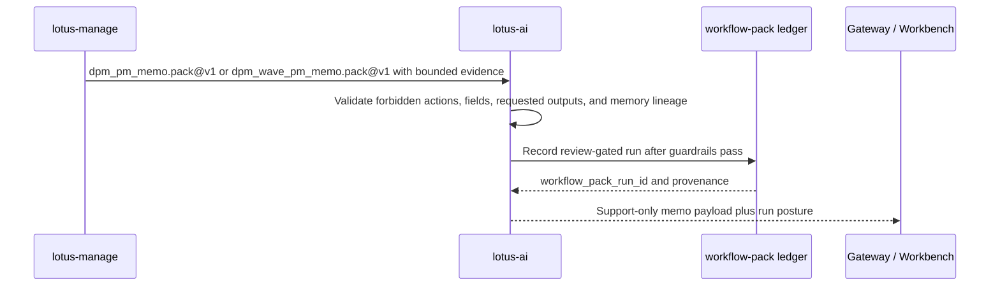

# Integrations

## Integration Model

`lotus-ai` is consumed through governed task and platform contracts.

The rule that matters most is:

1. the calling application owns the business context,
2. `lotus-ai` executes bounded AI behavior against that context,
3. the calling system remains accountable for business meaning and user-facing consequences.

## Primary Executable Contracts

The main executable contracts are:

1. `POST /ai/tasks/execute`
2. `GET /ai/audit`
3. `GET /ai/audit/{request_id}`

These three routes cover the real minimum integration loop:

1. submit one bounded task request,
2. receive a structured result plus audit and evidence metadata,
3. inspect the persisted audit trail when support or governance review is required.

The task execution contract itself requires:

1. `task_id`
2. `input_mode`
3. `caller`
4. `context`

The response returns:

1. execution status,
2. task category and output label,
3. result payload,
4. audit metadata,
5. structured execution evidence.

That audit and evidence shape is part of the real integration contract and should be preserved by
downstream systems.

## Direct Task API Versus Task-Runtime Inspection

Do not confuse the direct execution route with the task-runtime inspection surface.

These are different:

1. direct execution
   - `POST /ai/tasks/execute`
2. task-runtime inspection
   - `/platform/tasks/runtime-status`
   - `/platform/tasks/execution-summary`
   - `/platform/tasks/evidence-summary`
   - `/platform/tasks/retrieval-summary`
3. capability discovery
   - `/platform/capabilities`

Downstream systems should call the direct execution route for work, and use the task-runtime and
capability surfaces for onboarding, support review, and rollout decisions.

## Platform Discovery Contracts

Before integrating deeply, downstream teams should inspect the platform surfaces rather than infer
capability from one successful task response.

The most important discovery endpoints are:

1. `/platform/runtime-status`
2. `/platform/capabilities`
3. `/platform/providers`
4. `/platform/providers/policy`
5. `/platform/providers/operator-profile`
6. `/platform/providers/operations-status`
7. `/platform/prompts/runtime-status`
8. `/platform/safety/policy`
9. `/platform/retrieval/runtime-status`
10. `/platform/evals/runtime-status`

For more rollout-sensitive integrations, also inspect:

1. `/platform/tasks/runtime-status`
2. `/platform/access-control/caller-policies`
3. `/platform/capability-packs`
4. `/platform/workflow-packs/registry`
5. `/platform/use-cases/first-production-use-case`
6. `/platform/app-capability-rollouts`

## Gateway-First Rule

For product flows, the browser should normally call `lotus-gateway`, not `lotus-ai` directly.

The intended pattern is:

1. the browser calls `lotus-gateway`,
2. `lotus-gateway` assembles the governed fact bundle,
3. `lotus-gateway` invokes `lotus-ai`,
4. downstream UI preserves audit and evidence metadata from the result.

This keeps business context assembly and product ownership in the correct Lotus layer.

Direct service-to-service callers can integrate with `lotus-ai` directly, but they should still
follow the same ownership boundary:

1. the caller owns the business fact bundle,
2. `lotus-ai` owns bounded AI execution and evidence assembly,
3. the caller owns the business decision made from the result.

## Retrieval-Backed Integrations

Retrieval-backed tasks are special because they expose more than a plain text response.

`knowledge_search.v1` and `knowledge_answer.v1` can carry:

1. bounded retrieval hits,
2. citations,
3. support or refusal posture,
4. retrieval execution details such as catalog fallback versus live indexed retrieval.

Downstream systems should preserve those distinctions instead of flattening them into one generic
answer string.

They should also inspect retrieval posture directly when retrieval-backed behavior matters:

1. `/platform/retrieval/runtime-status`
2. `/platform/retrieval/execution-status`
3. `/platform/retrieval/source-governance`
4. `/platform/retrieval/document-governance`
5. `/platform/retrieval/search`

## Downstream Adoption Surfaces

`lotus-ai` also exposes higher-level adoption surfaces:

1. `/platform/capability-packs`
2. `/platform/workflow-packs/registry`
3. `/platform/use-cases/first-production-use-case`
4. `/platform/use-cases/onboarding-template`
5. `/platform/app-capability-rollouts`

These are useful when the integration work is about productized downstream rollout rather than only
calling one task endpoint.

The practical sequence for a new downstream adoption is:

1. inspect `/platform/capability-packs`
2. inspect the selected pack detail and adoption template
3. inspect `/platform/workflow-packs/registry` when the pack is intended to become a workflow-bearing runtime family
4. evaluate `/platform/workflow-packs/eligibility/evaluate` with the caller and surface posture that will actually invoke the pack
5. inspect `/platform/workflow-packs/control-history` when operator pause, resume, deprecate, or retire posture matters
6. inspect `/platform/use-cases/onboarding-template`
7. inspect `/platform/use-cases/first-production-use-case`
8. inspect `/platform/app-capability-rollouts`

That sequence keeps app-facing productization separate from low-level task execution.

For workflow-pack onboarding specifically, use `docs/guides/workflow-pack-owner-onboarding.md` as
the owner-facing procedure and do one more truth check before treating a registration as real:

1. `owner_repository` should match the repo that owns the workflow-bearing code path,
2. `definition_ref` should point at a real owner artifact, not a placeholder design note,
3. `definition_refs` should include enough owner-repo evidence to cover contract, service or router, and regression tests,
4. optional cross-repo RFC or UI references are supporting evidence, not a substitute for owner-repo truth.

## DPM PM Memo Integration

`dpm_pm_memo.pack@v1` and `dpm_wave_pm_memo.pack@v1` are the current `lotus-ai` owner-side
execution contracts for governed PM memo drafting from Manage evidence. The proof-pack pack is for
single proof-pack evidence; the wave pack is for rebalance-wave evidence that may summarize multiple
wave items and proof-pack refs.

Use it only when the caller supplies:

1. `ai_evidence_input` shaped as `lotus-manage` `DpmProofPackAiEvidenceInput`,
2. `memo_request` with allowed requested outputs such as `pm_memo`, `rationale_summary`,
   `approval_checklist`, `risk_caveats`, `operations_handoff`, or `evidence_gaps`,
3. `supportability` posture that states source readiness, human-review need, and unsupported claims,
4. optional `portfolio_memory_context` only when `lotus-manage` supplies the bounded report-input
   handoff context for the same portfolio.

The pack blocks requests for trade recommendations, order tickets, rebalance approval, client
messages, PM scoring, control overrides, hidden source inference, or forbidden sensitive fields.
When portfolio memory is supplied, it is validated as source-lineage-only context: matching
portfolio id, capped event refs, `NO_RAW_PAYLOADS`, source content hash, and a source-authority
policy that forbids reconstructing missing risk, performance, execution, report, or AI truth.
Downstream Gateway and Workbench product surfaces should preserve `workflow_pack_run_id`, proof-pack
hashes, AI-evidence hash, portfolio-memory content hash, review posture, and unsupported-claim
posture rather than flattening the memo into plain text.

Use `dpm_wave_pm_memo.pack@v1` only when the caller supplies:

1. `wave_report_input` shaped as `lotus-manage` `DpmWaveReportInput`,
2. `memo_request` with allowed requested outputs such as `wave_pm_memo`,
   `wave_rationale_summary`, `approval_checklist`, `risk_caveats`, `operations_handoff`, or
   `evidence_gaps`,
3. `supportability` posture with required forbidden actions and unsupported claims,
4. optional `portfolio_memory_context` only when `lotus-manage` supplies bounded source-lineage
   context for the same portfolio.

The wave pack additionally blocks external-execution claims and requires non-empty source refs,
bounded wave items, proof-pack posture, and `NO_RAW_PAYLOADS` redaction before run, audit, or
task-flow records are written.

`outcome_review_narrative.pack@v1` follows the same boundary for
`DpmOutcomeAiEvidenceInput`: `lotus-ai` can draft PM, CIO, control, operations, and evidence-gap
support commentary, but cannot score portfolio managers, contact clients, approve trades, override
controls, or infer timeline facts absent from source-owned Manage evidence.

## Provider and Safety Expectations

Callers must not assume that one successful response means unrestricted live-provider or safety
posture.

When the integration depends on live generation rather than deterministic stub behavior, inspect:

1. `/platform/providers`
2. `/platform/providers/policy`
3. `/platform/providers/operator-profile`
4. `/platform/providers/operations-status`

When the integration depends on blocked, redacted, or label-sensitive output handling, inspect:

1. `/platform/safety/policy`
2. `/platform/safety/runtime-status`
3. `/platform/safety/evidence-readiness`
4. `/platform/safety/governance-status`

## Integration Sources

- `docs/guides/integration-guide.md`
- `docs/guides/task-execution-contract.md`
- `docs/guides/workflow-pack-owner-onboarding.md`
- `docs/guides/prompt-registry-and-audit.md`
- `docs/guides/retrieval-and-vector-store.md`
- `docs/guides/lotus-performance-first-use-case.md`
- `demo/lotus-performance-first-use-case/README.md`

## Read Next

1. use [Platform Surfaces](./Platform-Surfaces.md) for the grouped public route map,
2. use [Security and Governance](./Security-and-Governance.md) for the boundary rules that constrain integrations,
3. use [Operations Runbook](./Operations-Runbook.md) when workflow-pack rollout or operator control posture needs a live check,
4. use [Troubleshooting](./Troubleshooting.md) when a runtime mode or provider path is not behaving as expected.
