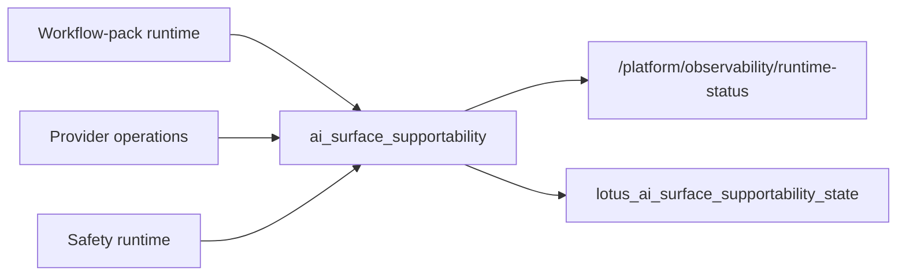

# Operations Runbook

## Current Scope

This runbook covers implemented first-response and operating procedures for the unified
`lotus-ai` service. A green process health check is necessary but does not prove provider,
workflow-pack, model-risk, attestation, or durable-store readiness.

| Situation | First action | Continue with |
|---|---|---|
| Process or traffic failure | Check `/health/live` and `/health/ready` | [Operational Entry Points](#operational-entry-points) |
| Degraded AI surface | Inspect `/platform/runtime-status` | [Operator-First Route Families](#operator-first-route-families) |
| Workflow-pack delay or rejection | Inspect registry, queue, run, and review posture | [Workflow-Pack Operator Checks](#workflow-pack-operator-checks) |
| Attestation rejection | Inspect run supportability, model approval, and key discovery | [Workflow-Run Attestation Checks](#workflow-run-attestation-checks) |
| Provider rollout change | Recreate services and verify provider operations | [Provider Changes](#provider-changes) |

## Operational Entry Points

The most important operator-facing endpoints are:

- `/health/live`
- `/health/ready`
- `/platform/runtime-status`
- `/metadata`

These tell you:

1. whether the process is running,
2. whether readiness is degraded,
3. which runtime and store modes are active,
4. which startup and readiness policies are currently configured.

For startup and rollout review, treat this as the first-pass sequence:

1. `/health/live`
2. `/health/ready`
3. `/metadata`
4. `/platform/runtime-status`

## HTTP Boundary And Error Responses

`lotus-ai` enforces service-owned HTTP boundary controls before endpoint handlers parse AI task,
retrieval, workflow-pack, prompt, provider, or audit payloads.

Configure the perimeter with:

1. `LOTUS_AI_HTTP_ALLOWED_HOSTS`
2. `LOTUS_AI_HTTP_CORS_ALLOWED_ORIGINS`
3. `LOTUS_AI_HTTP_CORS_ALLOWED_METHODS`
4. `LOTUS_AI_HTTP_CORS_ALLOWED_HEADERS`
5. `LOTUS_AI_HTTP_CORS_ALLOW_CREDENTIALS`
6. `LOTUS_AI_HTTP_SECURE_HEADERS_ENABLED`
7. `LOTUS_AI_HTTP_HSTS_ENABLED`
8. `LOTUS_AI_HTTP_HSTS_MAX_AGE_SECONDS`
9. `LOTUS_AI_HTTP_MAX_REQUEST_BODY_BYTES`

Operational expectations:

1. success and rejection responses carry `X-Correlation-Id`,
2. secure headers are present when enabled,
3. disallowed hosts and CORS preflight origins return bounded problem responses,
4. oversized requests return `413 application/problem+json` before domain handlers run,
5. clients should read `error_code` and `correlation_id` from the problem body rather than parsing
   prose in `detail`.

## Grouped Platform Surfaces

The service exposes a broad platform surface. The main groups are:

1. providers
   catalog, policy, operator profile, quota, budget, operations status, and control-plane actions
2. prompts
   catalog, control history, control actions, runtime status, and governance readiness
3. retrieval
   source governance, document governance, runtime status, execution status, and indexing or
   ingestion jobs
4. safety
   policy, runtime status, activation, evidence readiness, and governance
5. artifacts
   runtime status, descriptor-first catalog, activation readiness, and governance
6. evaluations
   catalog, runtime status, fixtures, and recorded runs
7. async runtime
   runtime status, queue backends, worker executions, jobs, and control-plane actions
8. observability
   runtime status, governance posture, incident summary, domain summaries, AI surface
   supportability, and bounded breakdowns
9. access control
   runtime, caller-policy catalog, and governance posture for caller authorization
10. task-runtime inspection
   runtime status plus execution, evidence, and retrieval summaries
11. capability packs, workflow packs, app-capability rollouts, and first-use-case surfaces
   adoption and rollout governance rather than direct execution

For the grouped route map, use [Platform Surfaces](./Platform-Surfaces.md).

## Operator-First Route Families

If the issue is broad and you do not yet know which subsystem is wrong, start here:

1. `/platform/runtime-status`
2. `/platform/observability/incident-summary`
3. `/platform/tasks/runtime-status`
4. the subsystem-specific governance or operations surface you depend on

For RFC-0108 AI-backed surface supportability, inspect the `ai_surface_supportability` block in
`/platform/observability/runtime-status` or the embedded `observability_runtime` block in
`/platform/runtime-status`. Treat it as the summary-first supportability posture for the currently
represented advisor brief, TWR inspection support brief, workspace rationale, and outcome-review
narrative surfaces, plus the DPM proof-pack PM memo and DPM wave PM memo surfaces; it is sourced from workflow-pack runtime,
provider operations, and safety runtime rather than from model availability alone.

Operator interpretation:

1. `metric_labels` must remain exactly `surface`, `posture`, and `source`.
2. `supportability_reason` is the bounded cause code for the current surface posture.
3. no-sensitive-content telemetry must be true before generated commentary, rationale, or brief
   surfaces are treated as supportable without sensitive-content telemetry gaps.
4. supportability evidence must not add portfolio, client, advisor, correlation, trace, prompt,
   request body, response body, or generated-output values to metrics or operator summaries.

Good examples:

1. provider posture
   - `/platform/providers/operator-profile`
   - `/platform/providers/operations-status`
2. retrieval posture
   - `/platform/retrieval/runtime-status`
   - `/platform/retrieval/execution-status`
3. async posture
   - `/platform/async/runtime-status`
   - `/platform/async/jobs`
4. prompt posture
   - `/platform/prompts/runtime-status`
   - `/platform/prompts/control-history`
5. evaluation posture
   - `/platform/evals/runtime-status`
   - `/platform/evals/runs`
6. workflow-pack rollout posture
   - `/platform/workflow-packs/registry`
   - `/platform/workflow-packs/queue-policies`
   - `/platform/workflow-packs/queue-status`
   - `/platform/workflow-packs/queue-events`
   - `/platform/workflow-packs/queue-events/{queue_item_id}/retry-decisions`
   - `/platform/workflow-packs/queue-events/{queue_item_id}/retry-executions`
   - `/platform/workflow-packs/queue-events/{queue_item_id}/replay-decisions`
   - `/platform/workflow-packs/queue-events/{queue_item_id}/replay-executions`
   - `/platform/workflow-packs/eligibility/evaluate`
   - `/platform/workflow-packs/control-history`
   - `/platform/workflow-packs/source-events`
   - `/platform/workflow-packs/runs/{run_id}/source-events`
7. production go-live posture
   - `/platform/production-baseline/runtime-status`
   - `/platform/production-go-live/runtime-status`
   - `/platform/production-go-live/governance-status`
   - `/platform/production-go-live/use-case-approval`

For production go-live, treat text-generation and embedding live-provider execution as the same
provider-governed approval family. Configured live-provider secret material must be
deployment-managed, and enabled retrieval must have approved retrieval governance backed by current
runtime evaluation evidence before platform production approval is true.

## Workflow-Pack Operator Checks

When a downstream team is trying to register, pause, resume, deprecate, or retire a workflow pack,
do not treat the registry row by itself as sufficient proof.

Use this sequence:

1. inspect `/platform/workflow-packs/registry`,
2. inspect the specific workflow-pack detail route for the pack and version in question,
3. confirm executable pack versions expose a declarative `queue_policy` and treat pack-backed
   execution failures as source evidence for actual queue-admission decisions,
4. evaluate `/platform/workflow-packs/eligibility/evaluate` with the real caller and surface posture,
5. inspect the embedded `queue_attention` block in `/platform/runtime-status` when lane
   saturation, stale active-admission posture, terminal queue posture, degraded queued-worker execution, blocked recovery posture,
   repeated-failure clusters, or degraded queue-source posture may explain delayed workflow-pack execution,
6. inspect `/platform/workflow-packs/queue-events` when support needs durable source evidence for queue admission requests, queued posture, admitted posture, execution handoff, rejections, releases, timeout posture, cancellation posture, degraded queued-worker execution, request-snapshot artifact refs, and retry/replay recovery decisions; use the retry/replay decision routes only with explicit actor, reason, and evidence reference, use retry/replay execution routes only when the source queue item carries a retained executable request snapshot, and use `/platform/workflow-packs/execute-async` when the intended source behavior is a new durable async worker execution,
7. inspect `/platform/workflow-packs/control-history` when rollout state changed or operator action is disputed; it returns newest-first bounded history with `limit` constrained to 1 through 200,
8. when `LOTUS_AI_WORKFLOW_PACK_REGISTRY_STORE_MODE=sqlalchemy`, confirm the embedded `workflow_pack_registry_store` block in `/platform/runtime-status` reports `READY` before treating activation state and control history as restart-safe truth,
9. when `LOTUS_AI_WORKFLOW_PACK_QUEUE_EVENT_STORE_MODE=sqlalchemy`, confirm the embedded `workflow_pack_queue_event_store` block in `/platform/runtime-status` reports `READY` before treating queue event history as restart-safe truth,
10. confirm `definition_ref` and `definition_refs` still resolve to the owning repository artifacts rather than placeholder notes,
11. when the issue is pack execution or review backlog rather than registration posture, inspect `/platform/workflow-packs/runs` and the embedded `workflow_pack_runtime` block in `/platform/runtime-status`,
12. when a downstream portfolio-memory consumer needs AI-owned source lineage, inspect
    `/platform/workflow-packs/source-events` or
    `/platform/workflow-packs/runs/{run_id}/source-events`; these are no-raw-payload projections
    from the run ledger and must not be used to reconstruct raw generated output, raw prompts, raw
    source payloads, or raw portfolio-memory event bodies,
13. if the embedded `workflow_pack_run_store` or `workflow_pack_queue_event_store` block is not `READY`, treat pack-backed `POST /ai/tasks/execute`, `POST /platform/workflow-packs/execute`, `POST /platform/workflow-packs/execute-async`, and workflow-pack source-event reads as preflight-blocked degraded-state signals rather than as requests that partially executed and then failed later,
14. if pack-backed execution returns a queue-policy `429`, treat it as admission rejected before
    audit, run-ledger, or task-flow side effects and inspect `/platform/workflow-packs/queue-events`
    for the reason code,
15. treat queue cancellation events as queue-boundary evidence only; they do not claim that
    already-running synchronous execution was interrupted, and treat `RETRY_RECORDED` or
    `REPLAY_RECORDED` as recovery-decision evidence unless it is returned by the explicit
    retry/replay execution route with a new workflow-pack execution response; durable async worker execution should appear as a `workflow_pack_execution` async job linked to the queue item,
16. when reading the embedded workflow-pack attention queue, treat `queue_depth` as the full actionable backlog and `items` as only the newest bounded sample up to `queue_limit`.

For AI-backed product-surface support, also confirm:

1. `ai_surface_supportability.metric_name` is `lotus_ai_surface_supportability_state`,
2. metric labels stay bounded to `surface`, `posture`, and `source`,
3. each represented surface carries a bounded `supportability_reason` so support can distinguish
   no-sensitive-telemetry degradation from workflow-pack action-required, ready, historical, or
   supported-no-activity posture without raw prompts or generated content,
4. each represented surface has `no_sensitive_content_telemetry=true` before treating generated
   commentary, rationale, or brief surfaces as supportable without sensitive-content telemetry gaps,
5. `twr_inspection_support_brief` remains owned by `lotus-performance`; do not reintroduce old
   `pa` naming in operator evidence or supportability records.
6. `dpm_pm_memo` remains owned by `lotus-manage` proof-pack evidence contracts; treat trade
   recommendations, order tickets, rebalance approvals, client messages, PM scoring, control
   overrides, and invented missing evidence as guardrail-blocked requests, not as prompt-tuning
   opportunities. Optional `portfolio_memory_context` is source-lineage-only context; investigate
   mismatched portfolio ids, raw payload fields, unbounded event refs, or missing no-reconstruction
   governance as caller contract defects.
7. `dpm_wave_pm_memo` remains owned by `lotus-manage` rebalance-wave report-input contracts; treat
   rebalance approvals, trade recommendations, order tickets, client messages, PM scoring, control
   overrides, external execution claims, and invented missing wave or proof-pack evidence as
   guardrail-blocked requests, not as prompt-tuning opportunities. Missing source refs, empty wave
   items, missing proof-pack posture, or non-`NO_RAW_PAYLOADS` redaction indicate caller contract
   defects that must be fixed at the source evidence boundary.
8. `dpm_operations_handoff_summary` remains owned by `lotus-manage` rebalance-wave handoff evidence
   contracts; treat order tickets, routing instructions, execution instructions, client messages,
   external execution claims, control overrides, and invented missing handoff evidence as
   guardrail-blocked requests. Missing handoff refs, malformed handoff refs, empty wave items, or
   non-`NO_RAW_PAYLOADS` redaction indicate caller contract defects that must be fixed at the
   source evidence boundary.
9. `dpm_exception_summary` remains owned by `lotus-manage` monitoring exception evidence
   contracts; treat rebalance approvals, order instructions, client messages, PM scoring, control
   overrides, and invented missing exception evidence as guardrail-blocked requests. Missing source
   refs, malformed source refs, empty exception sets, or non-`NO_RAW_PAYLOADS` redaction indicate
   caller contract defects that must be fixed at the source evidence boundary.
10. `outcome_review_narrative` remains owned by `lotus-manage` evidence contracts; treat PM scoring,
   client messages, trade approvals, control overrides, and invented missing evidence as
   guardrail-blocked requests, not as prompt-tuning opportunities. Optional portfolio-memory
   lineage can support review and demo provenance, but it must not be used to infer missing source
   facts.
11. `pm_quality_summary` remains owned by `lotus-manage` PM operating quality score-run evidence;
    treat PM ranking, HR ratings, compensation recommendations, conduct actions, client messages,
    trade approvals, execution instructions, and invented missing score-run evidence as
    guardrail-blocked requests. The pack is narrative support only and does not calculate PM scores
    or own fairness analysis.
12. `idea_explanation` remains owned by `lotus-idea` opportunity-intelligence and redacted
    idea-evidence contracts; treat suitability approval, proposal authority, rebalance authority,
    client-ready publication, supported-feature promotion, raw payload exposure, raw prompt/output
    exposure, and invented missing evidence as guardrail-blocked requests. The pack is
    review-gated explanation support only and does not own idea lifecycle truth. The caller policy
    should allow `lotus-idea` only for restricted-tenant `explain.v1` execution and should not grant
    live-provider or control-plane privilege.

## Workflow-Run Attestation Checks

Signed workflow-run provenance is a fail-closed release control, not a general run-detail export.
Use these checks when a downstream consumer reports missing or rejected attestation evidence:

| Signal | First check | Required interpretation |
|---|---|---|
| Run not found | `GET /platform/workflow-packs/runs/{run_id}/attestation` | Confirm the durable run store and exact run ID before checking keys |
| `supportability_not_ready` | Run detail, review state, evidence, and output-summary artifact | Do not bypass review or evidence requirements |
| `model_risk_not_approved` | Exact provider mode/ID, model ID/version, pack scope, approval window | Partial or expired inventory matches remain non-certifying |
| Signing unavailable | `GET /.well-known/lotus-ai-workflow-attestation-keys` | Require one active valid key and no duplicate key IDs |
| Consumer signature failure | Key ID, rotation epoch, issuer, audience, issue/expiry time | Refresh discovery; unknown or revoked keys fail closed |
| Replay rejection | Consumer receipt ledger | Replay protection belongs to the consuming application trust boundary |

Operational controls:

1. inject the raw Ed25519 private key only through the approved runtime secret mechanism,
2. never place private material in source, image layers, build arguments, labels, logs, or manifests,
3. retain rotated public keys until their governed verification and audit window ends,
4. publish compromised keys as `revoked` rather than silently removing trust history,
5. keep attestation TTL between 1 and 3600 seconds; the default is 300 seconds,
6. treat stub execution as `test_only`; it cannot receive an approved attestation.

The authoritative configuration, model-inventory schema, and rotation procedure are in
`docs/guides/workflow-run-attestations.md`.

The owner-facing source for that procedure is:

- `docs/guides/workflow-pack-owner-onboarding.md`

## Readiness Semantics

Two configuration flags matter operationally:

1. `LOTUS_AI_STARTUP_READINESS_POLICY`
2. `LOTUS_AI_READINESS_PROBE_POLICY`

Interpret them separately:

1. startup policy determines whether the process should start at all,
2. readiness-probe policy determines whether `/health/ready` should degrade.

In stronger environments, the intended posture is:

1. `enforce`
2. `degrade`

In local development, the normal posture is:

1. `warn`
2. `observe`

The practical reading rule is:

1. startup policy tells you whether the process should have been allowed to come up,
2. readiness-probe policy tells you whether traffic should still be routed.

## Provider Changes

Treat provider-mode changes as operational changes, not just config edits.

After every provider-mode change:

1. recreate `lotus-ai` and `lotus-ai-worker`,
2. verify `/health/ready`,
3. verify `/platform/providers/operator-profile`,
4. verify `/platform/providers`,
5. verify `/platform/providers/policy`,
6. verify `/platform/providers/operations-status`,
7. run one bounded `POST /ai/tasks/execute` request and confirm the audit fields match the expected
   provider path.

Source:

- `docs/runbooks/provider-mode-switching.md`

## SQL-Backed Environments

For SQL-backed environments, the intended operator flow is:

1. configure `LOTUS_AI_DATABASE_URL`,
2. apply migrations with `make migration-apply`,
3. start the service,
4. verify `/platform/runtime-status`,
5. inspect the specific runtime surfaces you depend on,
6. only then treat the runtime as ready.

`READY` is the only durable-state posture that should be treated as sufficient for stronger rollout
claims.

For SQL-backed stronger environments, also treat these as first-class checks rather than optional
detail:

1. `/platform/artifacts/runtime-status`
2. `/platform/access-control/runtime-status`
3. `/platform/evals/runtime-status`
4. `/platform/async/runtime-status`
5. `/platform/workflow-packs/control-history`
6. `/platform/workflow-packs/runs`

## Detailed Runbook Sources

- `docs/runbooks/service-operations.md`
- `docs/runbooks/provider-mode-switching.md`
- `docs/architecture/startup-readiness-deployment-policy.md`

## Read Next

1. use [Platform Surfaces](./Platform-Surfaces.md) for the grouped route map,
2. use [Troubleshooting](./Troubleshooting.md) for common failure patterns,
3. use [Security and Governance](./Security-and-Governance.md) when the question is about what the runtime is actually allowed to do.
