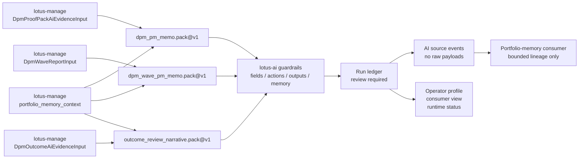

# Platform Surfaces

## Why This Page Exists

`lotus-ai` does not expose one flat API. It exposes a small direct execution surface plus a broad
set of platform, governance, and operator-facing surfaces.

This page groups the current public routes by router family so engineers can find the right surface
quickly without reading one long endpoint dump.

The groupings below are derived from the current FastAPI router layout in `src/app/main.py` and
`src/app/routers/`.

## Service Identity and Health Surface

Use these first when you need to answer "is the service up?" and "what mode is it running in?"

1. `/`
2. `/metadata`
3. `/health`
4. `/health/live`
5. `/health/ready`

## Direct Execution and Audit Surface

These are the smallest public integration surfaces and the ones most downstream callers start with.

1. `/ai/tasks/execute`
2. `/ai/audit`
3. `/ai/audit/{request_id}`
4. `/platform/workflow-packs/execute`

The separation matters:

1. `/ai/tasks/execute` is the bounded execution contract,
2. `/platform/workflow-packs/execute` is the explicit workflow-pack execution contract when a caller needs registered-pack eligibility, run recording, and explicit run identity in one step,
3. `/ai/audit` is the persisted execution and evidence review surface.

## Capability and Task-Runtime Surface

These surfaces tell you what `lotus-ai` can do and how task execution is behaving in practice.

1. capability catalog
   - `/platform/capabilities`
2. task-runtime posture and sampled execution summaries
   - `/platform/tasks/runtime-status`
   - `/platform/tasks/execution-summary`
   - `/platform/tasks/evidence-summary`
   - `/platform/tasks/retrieval-summary`

This is distinct from the direct execution API. It is the inspection and support surface around
task execution, not the execution entrypoint itself.

## Core Platform Governance Surface

These top-level operator and rollout surfaces describe broad service posture and cross-cutting
platform programs.

1. overall runtime posture
   - `/platform/runtime-status`
2. app-capability rollout governance
   - `/platform/app-capability-rollouts`
   - `/platform/app-capability-rollouts/governance-status`
   - `/platform/app-capability-rollouts/observability-summary`
   - `/platform/app-capability-rollouts/lifecycle-status`
   - `/platform/app-capability-rollouts/{downstream_app}/{capability_pack_id}`
   - `/platform/app-capability-rollouts/{downstream_app}/{capability_pack_id}/governance-status`
   - `/platform/app-capability-rollouts/{downstream_app}/{capability_pack_id}/lifecycle-status`
   - `/platform/app-capability-rollouts/{downstream_app}/{capability_pack_id}/onboarding-template`
3. cross-cutting rollout programs
   - `/platform/resilience/*`
   - `/platform/deployment-split/*`
   - `/platform/production-baseline/*`
   - `/platform/production-go-live/*`
4. workflow-pack runtime registration
   - `/platform/workflow-packs/registry`
   - `/platform/workflow-packs/registry/{pack_id}/{version}`
   - `/platform/workflow-packs/queue-policies`
   - `/platform/workflow-packs/queue-policies/{pack_id}/{version}`
   - `/platform/workflow-packs/queue-status`
   - `/platform/workflow-packs/queue-status/{queue_item_id}`
   - `/platform/workflow-packs/queue-events`
   - `/platform/workflow-packs/queue-events/{queue_item_id}`
   - `/platform/workflow-packs/queue-events/{queue_item_id}/retry-decisions`
   - `/platform/workflow-packs/queue-events/{queue_item_id}/retry-executions`
   - `/platform/workflow-packs/queue-events/{queue_item_id}/replay-decisions`
   - `/platform/workflow-packs/queue-events/{queue_item_id}/replay-executions`
   - `/platform/workflow-packs/eligibility/evaluate`
   - `/platform/workflow-packs/execute`
   - `/platform/workflow-packs/execute-async`
   - `/platform/workflow-packs/control-history`
   - `/platform/workflow-packs/control-actions`
   - `/platform/workflow-packs/source-events`
   - `/platform/workflow-packs/runs`
   - `/platform/workflow-packs/runs/{run_id}`
   - `/platform/workflow-packs/runs/{run_id}/source-events`
   - `/platform/workflow-packs/runs/{run_id}/operator-profile`
   - `/platform/workflow-packs/runs/{run_id}/consumer-view`
   - `/platform/workflow-packs/runs/{run_id}/review-actions`
   - `/platform/workflow-packs/task-flows`
   - `/platform/workflow-packs/task-flows/{task_flow_id}`
   - `/platform/workflow-packs/task-flows/{task_flow_id}/checkpoints`

The workflow-pack detail route now carries structured owner-artifact references as part of the registration record:

1. `definition_ref` is the primary repo-backed owner artifact,
2. `definition_refs` enumerate the concrete contract, service, router, tests, and optional supporting RFC or UI validation evidence behind the registration,
3. executable pack versions now expose declarative `queue_policy` posture in detail and
   `queue_policies` in the catalog,
4. pack-backed execution enforces the declared policy before task execution, audit persistence, run
   recording, or task-flow recording,
5. those references make the registry an onboarding and governance surface, not a second home for workflow implementation.

The workflow-pack run-ledger routes now add bounded runtime lineage for Phase-1 recorded runs:

1. `/platform/workflow-packs/runs` exposes recorded run state with runtime and review posture kept separate and now includes a bounded `review_summary` block on each run so downstream triage can inspect latest review provenance without fetching raw event history,
2. `/platform/workflow-packs/runs/{run_id}` exposes event history, evidence descriptors, governed artifact refs, bounded `allowed_review_actions`, and one bounded provenance summary for one recorded run,
3. `/platform/workflow-packs/runs/{run_id}/operator-profile` exposes one operator-facing supportability summary for review pending, failure, expiry, supersession, partial-output, artifact, and evidence posture, and now also carries one bounded provenance summary so support tools can inspect linked artifact and evidence types without fetching raw run detail,
4. `/platform/workflow-packs/runs/{run_id}/consumer-view` exposes one grouped runtime-review-lineage-provenance contract candidate for downstream composition layers, including artifact-backed provenance refs plus one bounded provenance summary for linked artifact and evidence posture,
5. `/platform/workflow-packs/source-events` and
   `/platform/workflow-packs/runs/{run_id}/source-events` expose AI-owned source events projected
   from the run ledger for portfolio-memory consumers. They include stable event identity, AI event
   type, run and pack identity, workflow-authority owner, supportability state, artifact refs,
   bounded source refs, portfolio-memory status/count/hash when supplied, `NO_RAW_PAYLOADS`, audit,
   retention, and source-authority policy. They deliberately omit raw prompts, raw generated
   output, raw source payloads, and raw portfolio-memory event payloads,
6. `/platform/workflow-packs/runs/{run_id}/review-actions` records bounded actor-attributed review transitions without taking consequence-bearing workflow authority,
7. `lotus-gateway` now uses that same bounded ledger seam to record advisor-brief review actions and returns refreshed workflow-pack posture through its advisor-brief contract without turning `lotus-ai` into the business-workflow owner,
8. `lotus-workbench` now has a typed client seam for the downstream advisor-brief review-action route, while UI-triggered business authorization remains a separate future slice,
9. the current executable workflow-pack set includes `advisor_brief.pack`,
   `workspace_rationale.pack`, `twr_inspection_support_brief.pack`, the review-gated
   `dpm_pm_memo.pack` contract for `lotus-manage` `DpmProofPackAiEvidenceInput`, the
   review-gated `dpm_wave_pm_memo.pack` contract for `lotus-manage` `DpmWaveReportInput`, and the
   review-gated `outcome_review_narrative.pack` contract for `lotus-manage`
   `DpmOutcomeAiEvidenceInput`. DPM proof-pack PM memo execution validates required proof-pack
   evidence, required forbidden actions, forbidden field names, forbidden requested outputs such as
   trade recommendations or client messages, and unsupported requested outputs before run, audit,
   or task-flow posture is recorded. DPM wave PM memo execution validates required wave report
   input fields, non-empty source refs, bounded wave items, proof-pack posture, `NO_RAW_PAYLOADS`,
   no-external-execution posture, forbidden actions, forbidden fields, and requested outputs before
   side effects are recorded. Outcome-review narrative execution validates required forbidden
   actions, rejects forbidden field names, rejects forbidden requested outputs such as PM scoring or
   client messages, records run and task-flow posture only after those guardrails pass, and remains
   support-only until Gateway and Workbench surfaces consume the contract. The DPM packs can
   consume optional manage-owned `portfolio_memory_context` as bounded source lineage, validating
   portfolio identity, capped event refs, source content hash, `NO_RAW_PAYLOADS`, and
   no-reconstruction source-authority policy before any side effects are recorded.

10. `/platform/runtime-status` now exposes `workflow_pack_run_store_mode`, `workflow_pack_run_store`, `workflow_pack_task_flow_store_mode`, `workflow_pack_task_flow_store`, `workflow_pack_queue_event_store_mode`, and `workflow_pack_queue_event_store` so operators can distinguish process-local workflow-pack runtime posture from SQL-backed durable ledger, task-flow, and queue-event posture,
11. the embedded `workflow_pack_runtime` block now also carries bounded review provenance on executable-pack latest ready and latest actionable run pointers plus the cross-pack attention queue, and now also carries bounded artifact and evidence linkage summaries for those same runtime-status items, so estate-level triage does not need a raw ledger fetch just to understand latest review movement or missing provenance posture,
12. pack-backed `503` degraded-state failures now preflight the workflow-pack run store before task execution and audit persistence, so callers should not expect new audit records or partial run-side effects when the run-ledger store is not ready,
13. the embedded workflow-pack attention queue now treats `queue_depth` as the full actionable backlog across executable pack versions, while `items` stays bounded by `queue_limit` as the newest visible sample,
14. `/platform/workflow-packs/queue-events`, `/platform/workflow-packs/queue-events/{queue_item_id}`, and the bounded retry/replay decision and execution routes expose durable queue admission, queued, admitted, execution-handoff, rejection, release, timeout, cancellation, degraded worker execution, request-snapshot artifact refs, retry/replay decision evidence, and bounded retry/replay execution from retained request snapshots without exposing raw worker internals, embedding raw task payloads, or replacing run-ledger, review-state, async job, or task-flow posture,
15. `/platform/workflow-packs/execute-async` persists a workflow-pack execution as a durable async runtime job backed by retained queue request-snapshot evidence; dedicated workers then execute it through the normal workflow-pack execution seam,
16. the embedded `queue_attention` block reports source-backed workflow-pack queue heartbeat posture for active-admission saturation, stale active admissions, durable timeout/cancellation/degraded worker-execution queue events, blocked retry/replay recovery decisions, repeated timeout/cancellation/blocked-recovery clusters, and degraded queue-source posture,
17. explicit `/platform/workflow-packs/execute` and `/platform/workflow-packs/execute-async` calls may request a governed `queue_lane`
    from the pack version's declared `allowed_lanes`; omitted lanes use the queue policy default,
    and unsupported lanes fail before audit, run, or task-flow side effects,
18. `/platform/workflow-packs/registry/{pack_id}/default` exposes the current governed default
    version for a workflow-pack family from registry truth. The route selects only registered,
    activation-eligible, non-superseded versions, and keeps discovered or dark successor versions
    visible but unpromoted.

RFC-0097 task-flow state is currently a read-only inspection family, not a public mutation or
handoff execution family:

1. task-flow and checkpoint descriptors are persisted behind memory or SQL-backed stores,
2. lifecycle transition guards are implemented inside `lotus-ai`,
3. Phase-1 workflow-pack execution records task-flow and checkpoint state for implicit and explicit pack-backed execution paths,
4. workflow-pack review actions synchronize task-flow review posture and replacement lineage,
5. accepted task flows record `READY_FOR_HANDOFF` posture for the workflow authority owner,
6. `/platform/workflow-packs/task-flows` plus detail and checkpoint routes expose cataloged posture,
7. `/platform/runtime-status` emits bounded heartbeat-style task-flow attention for waiting,
   blocked, stale, and action-required task flows,
8. public mutation routes and domain handoff execution remain future slices.

## Provider Surface

Prefix:

- `/platform/providers`

This family covers:

1. provider catalog and execution policy
2. operator profile
3. quota and budget policy
4. operations status
5. control-plane history and reset action
6. activation, runbook, evidence, and governance readiness

Key routes:

- `/platform/providers`
- `/platform/providers/policy`
- `/platform/providers/operator-profile`
- `/platform/providers/quota-policy`
- `/platform/providers/budget-policy`
- `/platform/providers/operations-status`
- `/platform/providers/control-plane-actions`
- `/platform/providers/control-plane-actions/reset`
- `/platform/providers/activation-readiness`
- `/platform/providers/runbook-readiness`
- `/platform/providers/evidence-readiness`
- `/platform/providers/governance-status`

## Prompt Surface

Prefix:

- `/platform/prompts`

This family covers:

1. prompt catalog and prompt-by-task detail
2. prompt governance and control history
3. prompt control actions
4. runtime, activation, runbook, evidence, and governance readiness

Key routes:

- `/platform/prompts`
- `/platform/prompts/{task_id}`
- `/platform/prompts/governance`
- `/platform/prompts/control-history`
- `/platform/prompts/control-actions`
- `/platform/prompts/runtime-status`
- `/platform/prompts/activation-readiness`
- `/platform/prompts/runbook-readiness`
- `/platform/prompts/evidence-readiness`
- `/platform/prompts/governance-status`

## Retrieval Surface

Prefix:

- `/platform/retrieval`

This is one of the broadest surfaces in the service. It covers:

1. source, document, and chunk inspection
2. source and document governance
3. runtime, index, ingestion, and execution status
4. indexing and ingestion job catalogs plus async submission paths
5. activation, runbook, evidence, and governance readiness
6. bounded retrieval search

Key route families:

- `/platform/retrieval/sources`
- `/platform/retrieval/source-governance`
- `/platform/retrieval/document-governance`
- `/platform/retrieval/index-status`
- `/platform/retrieval/runtime-status`
- `/platform/retrieval/ingestion-status`
- `/platform/retrieval/ingestion-jobs`
- `/platform/retrieval/ingestion-jobs/{job_id}`
- `/platform/retrieval/ingestion-jobs/{job_id}/submit-async`
- `/platform/retrieval/execution-status`
- `/platform/retrieval/activation-readiness`
- `/platform/retrieval/runbook-readiness`
- `/platform/retrieval/evidence-readiness`
- `/platform/retrieval/governance-status`
- `/platform/retrieval/indexing-policy`
- `/platform/retrieval/index-jobs`
- `/platform/retrieval/index-jobs/{job_id}`
- `/platform/retrieval/index-jobs/{job_id}/submit-async`
- `/platform/retrieval/sources/{source_id}/documents`
- `/platform/retrieval/documents/{document_id}/chunks`
- `/platform/retrieval/search`

## Safety Surface

Prefix:

- `/platform/safety`

This family is intentionally compact:

1. policy
2. runtime status
3. activation readiness
4. runbook readiness
5. governance status

## Artifact Surface

Prefix:

- `/platform/artifacts`

This family covers the governed artifact backbone rather than raw payload download:

1. runtime status
2. descriptor-first catalog
3. activation readiness
4. runbook readiness
5. governance status

## Evaluation Surface

Prefix:

- `/platform/evals`

This family covers:

1. evaluation catalog
2. runtime status
3. run catalog and run detail
4. run submission
5. fixture detail

Key routes:

- `/platform/evals/catalog`
- `/platform/evals/runtime-status`
- `/platform/evals/runs`
- `/platform/evals/runs/submit`
- `/platform/evals/fixtures/{fixture_id}`
- `/platform/evals/runs/{run_id}`

## Async Runtime Surface

Prefix:

- `/platform/async`

This family covers:

1. runtime status
2. queue-backend and worker-execution inventory
3. activation, runbook, and governance readiness
4. control-plane history and apply action
5. job catalog, job detail, and submission

Key routes:

- `/platform/async/runtime-status`
- `/platform/async/queue-backends`
- `/platform/async/worker-executions`
- `/platform/async/activation-readiness`
- `/platform/async/runbook-readiness`
- `/platform/async/governance-status`
- `/platform/async/control-plane-actions`
- `/platform/async/control-plane-actions/apply`
- `/platform/async/jobs`
- `/platform/async/jobs/{job_id}`
- `/platform/async/jobs/submit`

## Observability Surface

Prefix:

- `/platform/observability`

This family covers:

1. runtime, activation, runbook, and governance posture
2. incident summary
3. bounded summaries by provider, retrieval, async, evaluation, prompt, and safety
4. AI-backed surface supportability for advisor brief, TWR inspection support brief, workspace
   rationale, DPM PM memo, DPM wave PM memo, and outcome-review narrative surfaces, including bounded `supportability_reason` values and explicit
   `metric_labels` truth for `lotus_ai_surface_supportability_state`
5. breakdown views for operator analysis

## Access-Control Surface

Prefix:

- `/platform/access-control`

This family covers:

1. runtime status
2. activation readiness
3. runbook readiness
4. governance status
5. caller policy catalog

## Capability-Pack and Use-Case Adoption Surface

These are the app-facing rollout and onboarding surfaces rather than low-level runtime inspection.

1. capability packs
   - `/platform/capability-packs`
   - `/platform/capability-packs/governance-status`
   - `/platform/capability-packs/{pack_id}`
   - `/platform/capability-packs/{pack_id}/adoption-template`
   - `/platform/capability-packs/{pack_id}/observability-summary`
   - `/platform/capability-packs/{pack_id}/activation-readiness`
   - `/platform/capability-packs/{pack_id}/runbook-readiness`
   - `/platform/capability-packs/{pack_id}/governance-status`
2. workflow-pack registry
   - `/platform/workflow-packs/registry`
   - `/platform/workflow-packs/registry/{pack_id}/default`
   - `/platform/workflow-packs/registry/{pack_id}/{version}`
   - `/platform/workflow-packs/queue-policies`
   - `/platform/workflow-packs/queue-status`
   - `/platform/workflow-packs/queue-events`
   - `/platform/workflow-packs/queue-events/{queue_item_id}/retry-decisions`
   - `/platform/workflow-packs/queue-events/{queue_item_id}/retry-executions`
   - `/platform/workflow-packs/queue-events/{queue_item_id}/replay-decisions`
   - `/platform/workflow-packs/queue-events/{queue_item_id}/replay-executions`
   - `/platform/workflow-packs/eligibility/evaluate`
   - `/platform/workflow-packs/control-history`
   - `/platform/workflow-packs/control-actions`
3. app-capability rollouts
   - `/platform/app-capability-rollouts`
4. first production use-case and onboarding templates
   - `/platform/use-cases/first-production-use-case`
   - `/platform/use-cases/first-production-use-case/readiness`
   - `/platform/use-cases/first-production-use-case/runbook-readiness`
   - `/platform/use-cases/first-production-use-case/governance-status`
   - `/platform/use-cases/onboarding-template`

These are important when the work is about downstream adoption and rollout governance rather than
one isolated task call.

## Read Next

1. use [Integrations](./Integrations.md) for how downstream systems should consume these surfaces,
2. use [Operations Runbook](./Operations-Runbook.md) for the runtime interpretation of these groups,
3. use [Troubleshooting](./Troubleshooting.md) when one surface says something different from another.
